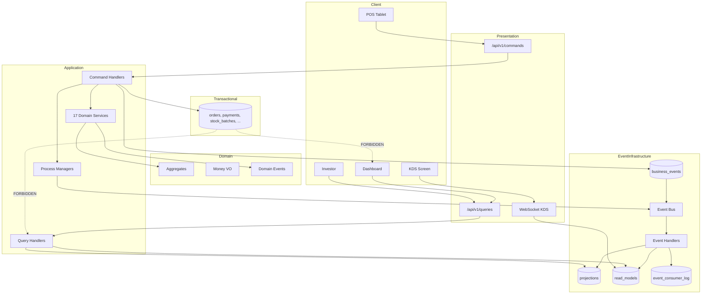

# Phase 0.5 — Architecture Freeze Report

**Project:** Warung Nafisah ERP  
**Document ID:** WN-FREEZE-001  
**Version:** 1.0.0  
**Date:** 2026-07-01  
**Status:** ARCHITECTURE FROZEN — Amended by ADR-001 (2026-07-01)  
**Author:** Principal Software Architect

---

## Executive Summary

Phase 0.5 completes the **Architecture Freeze** for Warung Nafisah ERP. All system contracts are documented, consistent, and ready to guide implementation without major design changes.

The architecture is built on:

> **"Every business action creates a permanent business event."**

Combined with **Clean Architecture**, **CQRS**, **Event-Driven internal design**, **Offline-First POS**, and **4-level organizational hierarchy** (Business Group → Business → Outlet → Warehouse).

**No application source code has been written.**

---

## 0. ADR-001 Amendment (2026-07-01)

**Repository strategy changed from Monorepo to Multi-Repository.**

| Decision | Document |
|----------|----------|
| ADR-001 approved | [ADR-001-multi-repository-strategy.md](./ADR-001-multi-repository-strategy.md) |
| Folder structure v2.0.0 | [21-folder-structure-final.md](./21-folder-structure-final.md) |
| Deployment architecture | [23-deployment-architecture.md](./23-deployment-architecture.md) |
| Development setup | [../implementation/06-development-setup.md](../implementation/06-development-setup.md) |
| CI/CD strategy | [../implementation/07-cicd-strategy.md](../implementation/07-cicd-strategy.md) |

**Unchanged:** Event DNA, CQRS, 62 events, 64 collections, domain contracts, security model.

**Superseded:** Monorepo `shared/` package, npm workspaces, frontend Docker, Phase 1.1 monorepo scaffold.

---

## 1. Summary of Changes: v1.1 → Phase 0.5

| Area | v1.1 | Phase 0.5 (Frozen) |
|------|------|-------------------|
| Architecture pattern | Event-driven (conceptual) | **Full CQRS + Event Store + Projections + Read Models** |
| Layer separation | General | **Commands / Domain / Event Store / Bus / Handlers / Projections / Read Models** |
| Event catalog | ~30 events informal | **62 events — formal catalog with versions** |
| Event metadata | Partial | **18 standard metadata fields frozen** |
| Collections | 38 conceptual | **64 collections classified (transactional/projection/read)** |
| Domain logic | In services (general) | **17 Domain Services — controllers orchestrate only** |
| Money | Number fields | **Money Value Object — no raw numbers in domain** |
| Document numbers | Order number only | **Universal Document Number Service (15 prefixes)** |
| API | REST general | **CQRS: `/commands` + `/queries`, `/api/v1`** |
| Error handling | General | **72 error codes with HTTP mapping** |
| RBAC | 6 roles | **12 roles with full permission matrix** |
| Saga | Mentioned | **Process Manager design with retry/compensation** |
| Integrations | Mentioned | **9 integrations in dedicated layer with ports** |
| Feature flags | Mentioned | **19 flags per tenant** |
| Settings | Outlet settings | **tenant_settings + outlet_settings schema** |
| Folder structure | Preview | **FINAL — frozen** |
| Testing | General | **9 test types including event replay** |
| Indexes | Basic | **~95 indexes with rationale** |
| Dashboard reads | Implied | **Explicitly forbidden from transactional collections** |

---

## 2. Documents Created or Revised

### New Documents (Phase 0.5)

| # | Document | Path |
|---|----------|------|
| 1 | Event Store Layer | `architecture/12-event-store-layer.md` |
| 2 | Event Metadata Standard | `architecture/13-event-metadata-standard.md` |
| 3 | Event Versioning Strategy | `architecture/14-event-versioning-strategy.md` |
| 4 | Projection Strategy | `architecture/15-projection-strategy.md` |
| 5 | Read Model Strategy | `architecture/16-read-model-strategy.md` |
| 6 | Domain Event Catalog (62 events) | `architecture/17-domain-event-catalog.md` |
| 7 | Event Naming Convention | `architecture/18-event-naming-convention.md` |
| 8 | Saga / Process Manager | `architecture/19-saga-process-manager.md` |
| 9 | Domain Services Catalog | `architecture/20-domain-services-catalog.md` |
| 10 | Folder Structure FINAL | `architecture/21-folder-structure-final.md` |
| 11 | Transaction Boundaries | `architecture/22-transaction-boundaries.md` |
| 12 | Money Value Object | `domain/01-money-value-object.md` |
| 13 | Document Number Service | `domain/02-document-number-service.md` |
| 14 | API Versioning Strategy | `api/01-api-versioning-strategy.md` |
| 15 | Error Code Catalog (72 codes) | `api/02-error-code-catalog.md` |
| 16 | Index Strategy | `database/02-index-strategy.md` |
| 17 | Collections Final Registry | `database/03-collections-final-registry.md` |
| 18 | RBAC Permission Matrix | `security/01-rbac-permission-matrix.md` |
| 19 | Feature Flags | `security/03-feature-flags.md` |
| 20 | Tenant Settings | `security/04-tenant-settings.md` |
| 21 | Integration Layer | `implementation/03-integration-layer.md` |
| 22 | Testing Strategy | `testing/01-testing-strategy.md` |
| 23 | Seed Strategy | `testing/02-seed-strategy.md` |
| 24 | Performance Strategy | `performance/01-performance-strategy.md` |
| 25 | Architecture Freeze Checklist | `verification/01-architecture-freeze-checklist.md` |
| 26 | Phase 1 TODO | `todo/phase1-todo.md` |
| 27 | **This Report** | `architecture/00-phase0.5-freeze-report.md` |

### Preserved from Phase 0 / v1.1 (Still Valid)

| Document | Path |
|----------|------|
| Business Analysis (v1.1) | `architecture/01-business-analysis.md` |
| SRS | `architecture/02-software-requirements-specification.md` |
| Functional Requirements | `architecture/03-functional-requirements.md` |
| Enterprise FR Addendum | `architecture/03b-enterprise-functional-requirements.md` |
| Event-Driven Architecture | `architecture/09-event-driven-architecture.md` |
| Enterprise Requirements | `architecture/10-enterprise-requirements.md` |
| ERD v1.1 | `database/01-entity-relationship-diagram.md` |
| Module Overview v1.1 | `modules/00-module-overview.md` |
| Roadmap v1.1 | `implementation/01-roadmap.md` |
| Timeline v1.1 | `implementation/02-timeline.md` |

---

## 3. Updated Architecture Diagram

---

## 4. Business Event Catalog — Final (62 Events)

| Module | Count | Examples |
|--------|-------|----------|
| POS & Orders | 12 | OrderCreated, SaleCompleted, SaleRefunded |
| Inventory | 11 | InventoryConsumed, LowStockDetected |
| Purchase | 7 | PurchaseReceived, PurchasePriceRecorded |
| Finance | 9 | CashflowRecorded, DailyClosingCompleted |
| Kitchen | 6 | KitchenTicketCreated, OrderItemReady |
| Recipe & Production | 6 | RecipePublished, ProductionCompleted |
| Shift & Operations | 5 | ShiftOpened, ShiftClosed |
| Approval | 4 | ApprovalRequested, ApprovalGranted |
| CRM | 3 | CustomerRegistered (feature-flagged) |
| Payroll & HR | 4 | PayrollPaid, AttendanceRecorded |
| Auth | 3 | UserLoggedIn |
| Notification | 2 | NotificationSent |
| Backup & System | 4 | BackupCompleted, SystemHealthAlert |
| Sync | 3 | SyncBatchUploaded |
| Reporting | 1 | ReportGenerated |
| Settings | 2 | TenantSettingsUpdated, FeatureFlagToggled |
| **TOTAL** | **62** | |

Full catalog: [17-domain-event-catalog.md](./17-domain-event-catalog.md)

---

## 5. Collections — Final (64)

| Category | Count |
|----------|-------|
| Hierarchy & Tenant | 6 |
| Event Store & CQRS | 6 |
| Transactional Aggregates | 14 |
| Operations | 8 |
| Projections | 11 |
| Read Models | 8 |
| System & Support | 11 |
| **TOTAL** | **64** |

Full registry: [database/03-collections-final-registry.md](../database/03-collections-final-registry.md)

---

## 6. Modules — Final (32)

| # | Module | Type |
|---|--------|------|
| 1 | Hierarchy | Core |
| 2 | Event Engine | Infrastructure |
| 3 | Authentication | Core |
| 4 | Settings / Tenant | Core |
| 5 | Shift Management | Operations |
| 6 | Approval Workflow | Operations |
| 7 | POS + Offline Sync | Operations |
| 8 | KDS | Operations |
| 9 | Orders | Operations |
| 10 | Payments | Operations |
| 11 | Digital Receipt | Operations |
| 12 | Daily Closing | Operations |
| 13 | Inventory | Supply Chain |
| 14 | Recipes (versioned) | Supply Chain |
| 15 | Production | Supply Chain |
| 16 | Purchasing | Supply Chain |
| 17 | Suppliers | Supply Chain |
| 18 | Unit Conversion | Domain |
| 19 | Document Numbering | Domain |
| 20 | Cashflow / Ledger | Finance |
| 21 | Expenses | Finance |
| 22 | Dashboard | Intelligence |
| 23 | Reports | Intelligence |
| 24 | Notification Engine | Intelligence |
| 25 | Audit Timeline | Intelligence |
| 26 | Analytics / AI Feed | Intelligence |
| 27 | Investor Dashboard | Intelligence |
| 28 | HR (Employees, Attendance, Salary) | HR |
| 29 | Assets | HR |
| 30 | System Health | Ops |
| 31 | Backup | Ops |
| 32 | Integrations | Infrastructure |

---

## 7. Architecture Decision Review

| # | Decision | Review | Status |
|---|----------|--------|--------|
| 1 | Business Event as source of truth | Eliminates duplicate input; enables replay, AI, sync | ✅ Approved |
| 2 | CQRS strict — no dashboard on transactional | Scales to 100 outlets; clear boundaries | ✅ Approved |
| 3 | In-process event bus + BullMQ | Simple MVP; upgrade path to Redis Streams | ✅ Approved |
| 4 | No rollback of primary events | Saga compensation instead; audit integrity | ✅ Approved |
| 5 | Money as Value Object | Prevents float errors; IDR precision | ✅ Approved |
| 6 | 4-level hierarchy | Multi-business SaaS ready | ✅ Approved |
| 7 | 12 roles RBAC | Covers restaurant + finance + audit | ✅ Approved |
| 8 | Feature flags per tenant | Modular rollout (CRM, AI, Payroll) | ✅ Approved |
| 9 | Integration ports pattern | Clean Architecture compliance | ✅ Approved |
| 10 | Offline via event sync | Idempotent; same primitive as online | ✅ Approved |
| 11 | Immutable recipe versions | HPP integrity on historical orders | ✅ Approved |
| 12 | Universal document numbering | Consistent audit trail | ✅ Approved |
| 13 | Commands/Queries API split | CQRS at HTTP boundary | ✅ Approved |
| 14 | Folder structure frozen | Parallel development possible | ✅ Approved |
| 15 | 62 events (not 50) | Complete coverage all modules | ✅ Approved |

---

## 8. Risks Eliminated by Architecture Freeze

| Risk (from v1.0) | How Eliminated |
|------------------|----------------|
| TR-001 Transaction inconsistency | Frozen transaction boundaries; event + aggregate in same session |
| TR-005 Internet outage stops POS | Offline-first event queue architecture |
| TR-009 Handler failure inconsistent state | Saga retry + event_consumer_log + dead letter + replay |
| TR-010 Offline sync conflicts | eventId idempotency + sync_conflicts workflow |
| PR-004 Insufficient financial testing | Event replay test + reconciliation scripts in test strategy |
| Dashboard performance at scale | Read models — O(1) lookup per outlet |
| HPP retroactive changes | recipe_versions immutable + order line snapshot |
| Schema drift | Event versioning strategy + JSON Schema registry |
| Integration coupling | Port/adapter pattern in integrations/ |
| Scope creep | Feature flags per tenant |
| Money calculation errors | Money Value Object mandatory in domain |
| Document number collision | Atomic document_sequences with daily reset |

---

## 9. Architecture Freeze Checklist

See [verification/01-architecture-freeze-checklist.md](../verification/01-architecture-freeze-checklist.md)

**All 40+ criteria documented.** Sign-off pending.

---

## 10. Phase 1 TODO

See [todo/phase1-todo.md](../todo/phase1-todo.md)

Summary:
1. JSON Schema for 62 events
2. Mongoose schema definitions (64 collections)
3. OpenAPI 3.0 specification
4. UI wireframes
5. Phase 1 review → Phase 2 scaffold

---

## 11. Frozen Contracts Summary

| Contract | Location |
|----------|----------|
| Event metadata | `architecture/13-event-metadata-standard.md` |
| Event catalog | `architecture/17-domain-event-catalog.md` |
| Event naming | `architecture/18-event-naming-convention.md` |
| Projections | `architecture/15-projection-strategy.md` |
| Read models | `architecture/16-read-model-strategy.md` |
| Domain services | `architecture/20-domain-services-catalog.md` |
| Money VO | `domain/01-money-value-object.md` |
| Doc numbers | `domain/02-document-number-service.md` |
| API versioning | `api/01-api-versioning-strategy.md` |
| Error codes | `api/02-error-code-catalog.md` |
| RBAC | `security/01-rbac-permission-matrix.md` |
| Feature flags | `security/03-feature-flags.md` |
| Tenant settings | `security/04-tenant-settings.md` |
| Indexes | `database/02-index-strategy.md` |
| Collections | `database/03-collections-final-registry.md` |
| Folder structure | `architecture/21-folder-structure-final.md` |
| Transaction boundaries | `architecture/22-transaction-boundaries.md` |
| Saga | `architecture/19-saga-process-manager.md` |
| Testing | `testing/01-testing-strategy.md` |
| Seed | `testing/02-seed-strategy.md` |
| Performance SLA | `performance/01-performance-strategy.md` |

---

## 12. Approval

| Item | Status |
|------|--------|
| Architecture Freeze complete | ✅ |
| All contracts documented | ✅ |
| No application code written | ✅ |
| Ready for Phase 1 implementation contracts | ✅ |
| Stakeholder sign-off | ☐ Pending |

---

**Reply with "Architecture Freeze Approved — Proceed to Phase 1" to begin implementation contracts (schemas, OpenAPI, wireframes).**

---

*Warung Nafisah ERP — Phase 0.5 Architecture Freeze — 2026-07-01*
