# Use Cases

**Project:** Warung Nafisah ERP  
**Document ID:** WN-UC-001  
**Version:** 1.0.0  
**Status:** Draft — Awaiting Approval

---

## 1. Actor Definitions

| Actor | Description |
|-------|-------------|
| Owner | Business proprietor with full system access |
| Manager | Outlet manager — operations, approvals, reports |
| Cashier | Front counter — POS, orders, payments |
| Kitchen Staff | Food preparation — KOT fulfillment |
| Inventory Staff | Stock management — purchasing, adjustments |
| Investor | Read-only financial stakeholder |
| System | Automated background processes |

---

## 2. Use Case Diagram (Overview)

```mermaid
graph TB
    subgraph Actors
        Owner
        Manager
        Cashier
        Kitchen[Kitchen Staff]
        InvStaff[Inventory Staff]
        Investor
    end

    subgraph Core Operations
        UC01[Login / Logout]
        UC02[Process Sale - POS]
        UC03[Fulfill Kitchen Order]
        UC04[Manage Inventory]
        UC05[Record Purchase]
        UC06[Run Production]
        UC07[Manage Recipes]
        UC08[Record Expense]
        UC09[View Dashboard]
        UC10[Generate Reports]
    end

    subgraph HR
        UC11[Manage Employees]
        UC12[Clock Attendance]
        UC13[Process Salary]
    end

    subgraph Admin
        UC14[Manage Users & Roles]
        UC15[Configure Settings]
        UC16[View Audit Logs]
        UC17[Investor Dashboard]
    end

    Cashier --> UC01
    Cashier --> UC02
    Kitchen --> UC01
    Kitchen --> UC03
    InvStaff --> UC01
    InvStaff --> UC04
    InvStaff --> UC05
    InvStaff --> UC06
    Manager --> UC01
    Manager --> UC07
    Manager --> UC08
    Manager --> UC09
    Manager --> UC10
    Manager --> UC11
    Manager --> UC12
    Manager --> UC13
    Manager --> UC14
    Manager --> UC15
    Manager --> UC16
    Owner --> UC09
    Owner --> UC10
    Owner --> UC14
    Owner --> UC15
    Owner --> UC16
    Investor --> UC01
    Investor --> UC17
```

---

## 3. Detailed Use Cases

### UC-001: User Login

| Field | Value |
|-------|-------|
| **ID** | UC-001 |
| **Name** | User Login |
| **Actor** | All users |
| **Priority** | P0 |
| **Precondition** | User account exists and is active |
| **Postcondition** | User authenticated; JWT issued; redirected to role-appropriate dashboard |

**Main Flow:**
1. User opens application
2. User enters credentials
3. System validates credentials
4. System issues access + refresh tokens
5. System redirects to dashboard based on role

**Alternate Flows:**
- 3a. Invalid credentials → show error, increment failed attempts
- 3b. Account locked → show lockout message with retry time
- 3c. Investor login → redirect to Investor Dashboard (read-only)

---

### UC-002: Process Sale (POS)

| Field | Value |
|-------|-------|
| **ID** | UC-002 |
| **Name** | Process Sale |
| **Actor** | Cashier |
| **Priority** | P0 |
| **Precondition** | Cashier logged in; shift active; menu items have recipes |
| **Postcondition** | Order completed; payment recorded; inventory consumed; financial ledger updated |

**Main Flow:**
1. Cashier opens POS screen
2. System displays menu filtered by current shift
3. Cashier selects menu items and quantities
4. System calculates subtotal
5. Cashier applies discount (if any)
6. Cashier selects payment method (Cash / QRIS / Transfer)
7. Cashier confirms payment
8. System atomically:
   - Creates order + payment records
   - Consumes recipe ingredients (FIFO inventory OUT)
   - Calculates and stores HPP per line item
   - Creates cashflow IN ledger entry
   - Sends KOT to kitchen
9. System prints/displays receipt
10. System updates dashboard metrics

**Alternate Flows:**
- 3a. Insufficient stock → block sale or request Manager override
- 5a. Discount exceeds threshold → require Manager PIN/approval
- 6a. Cancel order → revert to step 2, no financial impact
- 7a. Refund (post-payment) → see UC-002b

**UC-002b: Process Refund**
1. Cashier selects completed order
2. Cashier initiates refund with reason
3. Manager approves
4. System reverses: payment, inventory (if applicable), ledger, profit
5. Audit log entry created

---

### UC-003: Fulfill Kitchen Order (KOT)

| Field | Value |
|-------|-------|
| **ID** | UC-003 |
| **Name** | Fulfill Kitchen Order |
| **Actor** | Kitchen Staff |
| **Priority** | P0 |
| **Precondition** | New order with KOT generated |
| **Postcondition** | Order status updated; cashier notified when ready |

**Main Flow:**
1. Kitchen staff opens KOT view
2. System displays pending orders (newest first)
3. Kitchen staff marks order as "Preparing"
4. Kitchen staff completes food preparation
5. Kitchen staff marks order as "Ready"
6. System notifies cashier (visual/audio alert)

---

### UC-004: Record Purchase (Goods Receipt)

| Field | Value |
|-------|-------|
| **ID** | UC-004 |
| **Name** | Record Purchase |
| **Actor** | Inventory Staff |
| **Priority** | P1 |
| **Precondition** | Supplier exists; inventory items defined |
| **Postcondition** | Stock increased; expense recorded; supplier history updated |

**Main Flow:**
1. Inventory staff creates purchase order (supplier, items, qty, unit price)
2. Goods arrive — staff confirms receipt
3. System atomically:
   - Creates FIFO stock batch per item (qty, unit cost, expiry)
   - Records purchase expense (COGS category)
   - Creates cashflow OUT entry
   - Updates supplier transaction history
4. Dashboard low-stock alerts refreshed
5. Audit log entry created

---

### UC-005: Run Production Batch

| Field | Value |
|-------|-------|
| **ID** | UC-005 |
| **Name** | Run Production Batch |
| **Actor** | Inventory Staff / Kitchen Staff |
| **Priority** | P1 |
| **Precondition** | Production recipe/BOM defined; raw materials in stock |
| **Postcondition** | Raw materials consumed; finished goods added; cost recorded |

**Main Flow:**
1. Staff selects production recipe (e.g., pre-batch Gendum broth)
2. Staff enters batch quantity (yield)
3. System calculates required raw materials
4. System validates sufficient raw material stock
5. Staff confirms production
6. System atomically:
   - Deducts raw materials (FIFO OUT)
   - Adds finished goods (FIFO IN at production cost)
   - Records production cost
7. Stock history updated

**Example:** Morning shift — produce Gendum Kuah Tetelan base in batch before service.

---

### UC-006: Manage Recipe

| Field | Value |
|-------|-------|
| **ID** | UC-006 |
| **Name** | Manage Recipe |
| **Actor** | Manager |
| **Priority** | P0 |
| **Precondition** | Menu item exists; inventory items exist |
| **Postcondition** | Recipe saved; HPP auto-calculated |

**Main Flow:**
1. Manager navigates to Recipes
2. Manager selects menu item
3. Manager adds ingredients with quantity and unit
4. System validates units match inventory item units
5. System calculates current HPP from FIFO costs
6. Manager saves recipe
7. Recipe version stored in history

---

### UC-007: Stock Adjustment

| Field | Value |
|-------|-------|
| **ID** | UC-007 |
| **Name** | Stock Adjustment |
| **Actor** | Inventory Staff |
| **Priority** | P0 |
| **Precondition** | Inventory item exists |
| **Postcondition** | Stock quantity corrected; history recorded |

**Main Flow:**
1. Staff selects inventory item
2. Staff enters adjustment quantity (+ or −) and reason
3. If large adjustment → Manager approval required
4. System updates stock and creates stock history entry
5. Audit log entry created

---

### UC-008: Record Expense

| Field | Value |
|-------|-------|
| **ID** | UC-008 |
| **Name** | Record Expense |
| **Actor** | Manager |
| **Priority** | P1 |
| **Precondition** | Expense category configured |
| **Postcondition** | Expense recorded; cashflow OUT; reports updated |

**Main Flow:**
1. Manager opens Expenses
2. Manager enters: category, amount, date, description, payment method
3. System creates expense record + cashflow OUT
4. Dashboard and reports updated

---

### UC-009: View Dashboard

| Field | Value |
|-------|-------|
| **ID** | UC-009 |
| **Name** | View Dashboard |
| **Actor** | Owner, Manager |
| **Priority** | P0 |
| **Precondition** | User authenticated with dashboard permission |
| **Postcondition** | Real-time KPIs displayed |

**Main Flow:**
1. User opens dashboard
2. System aggregates today's data:
   - Sales, profit, expenses
   - Payment method breakdown
   - Best sellers
   - Low stock items
   - Attendance summary (if HR module active)
3. Data displayed in cards and charts

---

### UC-010: Generate Report

| Field | Value |
|-------|-------|
| **ID** | UC-010 |
| **Name** | Generate Report |
| **Actor** | Owner, Manager |
| **Priority** | P0 |
| **Precondition** | Transaction data exists for selected period |
| **Postcondition** | Report displayed / exported |

**Main Flow:**
1. User selects report type (sales, expense, profit, inventory, cashflow)
2. User selects period (daily, weekly, monthly, yearly)
3. User optionally sets date range
4. System aggregates from transaction ledger
5. System displays report with charts and tables
6. User optionally exports PDF/CSV

---

### UC-011: Investor View Financial Dashboard

| Field | Value |
|-------|-------|
| **ID** | UC-011 |
| **Name** | Investor View Financial Dashboard |
| **Actor** | Investor |
| **Priority** | P3 |
| **Precondition** | Investor logged in |
| **Postcondition** | Read-only financial data displayed |

**Main Flow:**
1. Investor logs in
2. System redirects to Investor Dashboard
3. System displays: revenue, profit, expense charts, cashflow
4. Investor cannot access any edit/create/delete actions

**Constraint:** API returns 403 for any mutation request from Investor role.

---

### UC-012: Clock Attendance

| Field | Value |
|-------|-------|
| **ID** | UC-012 |
| **Name** | Clock Attendance |
| **Actor** | Employee, Manager |
| **Priority** | P2 |
| **Precondition** | Employee record exists |
| **Postcondition** | Attendance record created |

**Main Flow:**
1. Employee opens attendance screen
2. Employee taps "Clock In" or "Clock Out"
3. System records timestamp and employee ID
4. Dashboard attendance widget updated

---

### UC-013: End-of-Day Shift Close

| Field | Value |
|-------|-------|
| **ID** | UC-013 |
| **Name** | End-of-Day Shift Close |
| **Actor** | Manager, Cashier |
| **Priority** | P1 |
| **Precondition** | All orders for shift processed |
| **Postcondition** | Shift closed; reconciliation report generated |

**Main Flow:**
1. Cashier/Manager initiates shift close
2. System generates reconciliation:
   - Expected cash vs actual cash count (manual input)
   - QRIS total vs payment records
   - Transfer total vs payment records
3. Manager reviews discrepancies
4. Manager confirms shift close
5. Shift summary stored; audit log created

---

## 4. Use Case Priority Matrix

| Use Case | Priority | Phase |
|----------|----------|-------|
| UC-001 Login | P0 | Phase 3 |
| UC-002 Process Sale | P0 | Phase 4 (POS) |
| UC-003 Fulfill KOT | P0 | Phase 4 |
| UC-004 Record Purchase | P1 | Phase 6 |
| UC-005 Run Production | P1 | Phase 6 |
| UC-006 Manage Recipe | P0 | Phase 5 |
| UC-007 Stock Adjustment | P0 | Phase 5 |
| UC-008 Record Expense | P1 | Phase 7 |
| UC-009 View Dashboard | P0 | Phase 4 |
| UC-010 Generate Report | P0 | Phase 4 |
| UC-011 Investor Dashboard | P3 | Phase 9 |
| UC-012 Clock Attendance | P2 | Phase 8 |
| UC-013 Shift Close | P1 | Phase 4 |

---

## 5. Use Case ↔ Functional Requirement Traceability

| Use Case | FR IDs |
|----------|--------|
| UC-001 | FR-AUTH-001..009 |
| UC-002 | FR-POS-001..013, FR-ORD-001..006, FR-PAY-001..002 |
| UC-003 | FR-ORD-002, FR-POS-009 |
| UC-004 | FR-PUR-001..006, FR-SUP-001..002 |
| UC-005 | FR-PROD-001..005 |
| UC-006 | FR-REC-001..006 |
| UC-007 | FR-INV-004..005 |
| UC-008 | FR-EXP-001..004 |
| UC-009 | FR-DASH-001..008 |
| UC-010 | FR-RPT-001..008 |
| UC-011 | FR-INVST-001..004 |
| UC-012 | FR-ATT-001..004 |
| UC-013 | FR-PAY-004 |
