# Business Flowcharts

**Project:** Warung Nafisah ERP  
**Document ID:** WN-FLOW-001  
**Version:** 1.1.0  
**Status:** Draft — Awaiting Re-Approval

---

## 1. System Context Flow

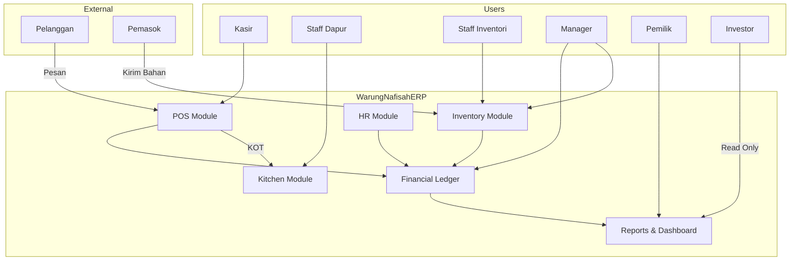

---

## 2. POS Sale Flow (Zero Duplicate Input)

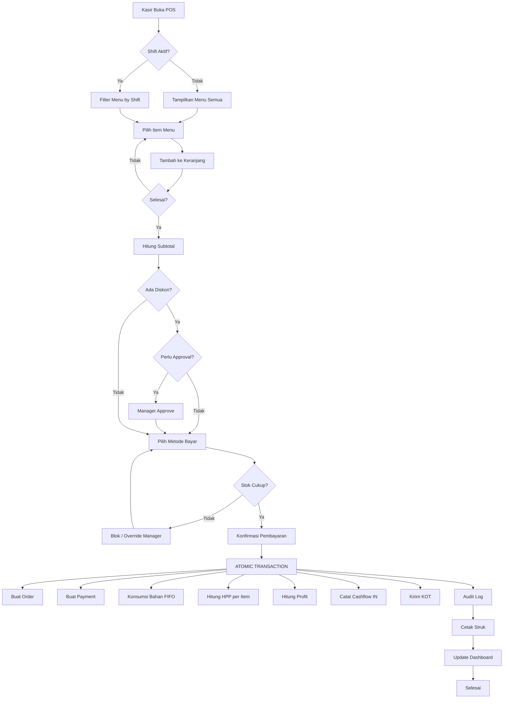

---

## 3. Purchase Flow

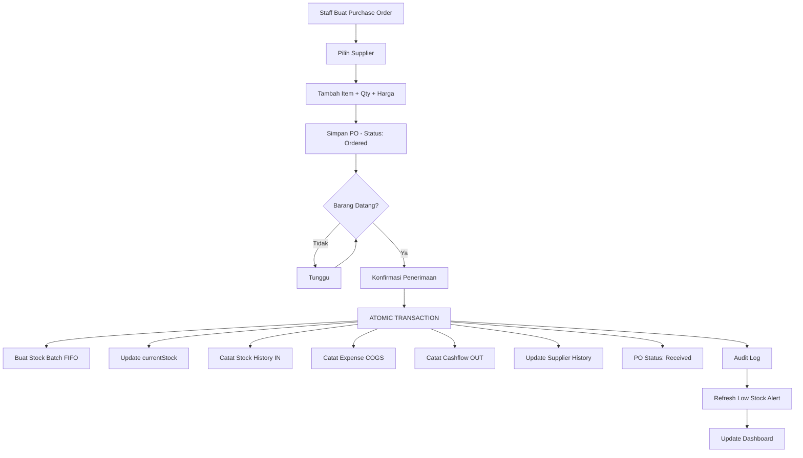

---

## 4. Production Flow

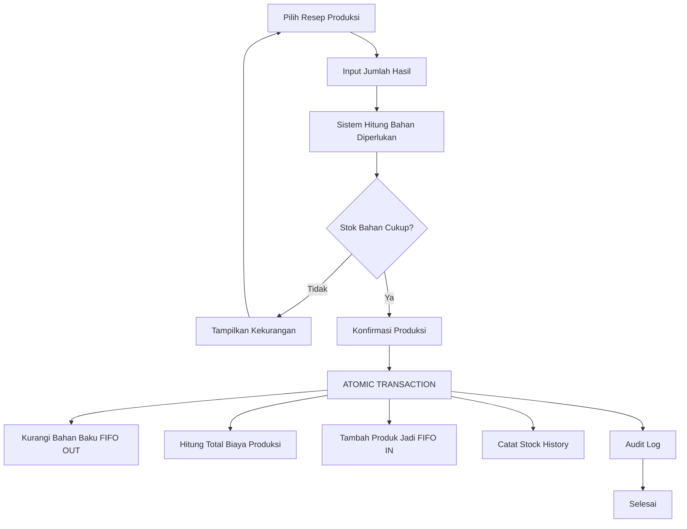

---

## 5. Recipe & HPP Calculation Flow

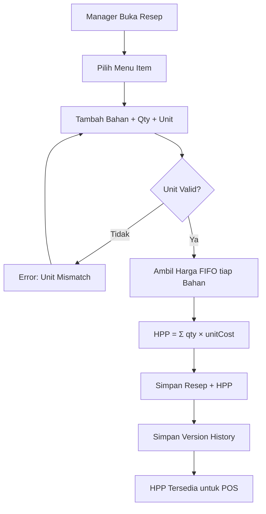

---

## 6. Refund Flow

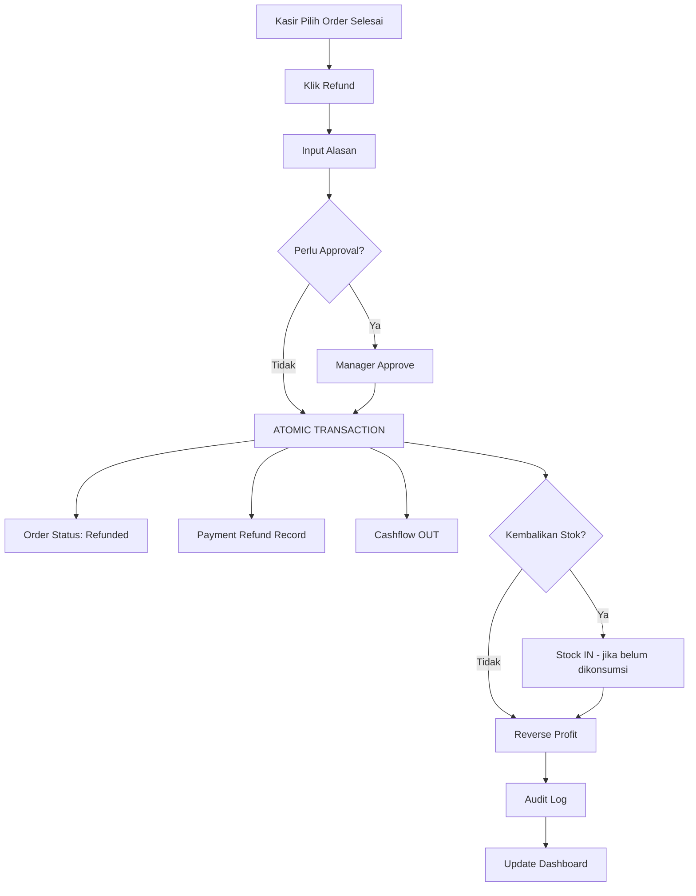

---

## 7. End-of-Day Shift Close Flow

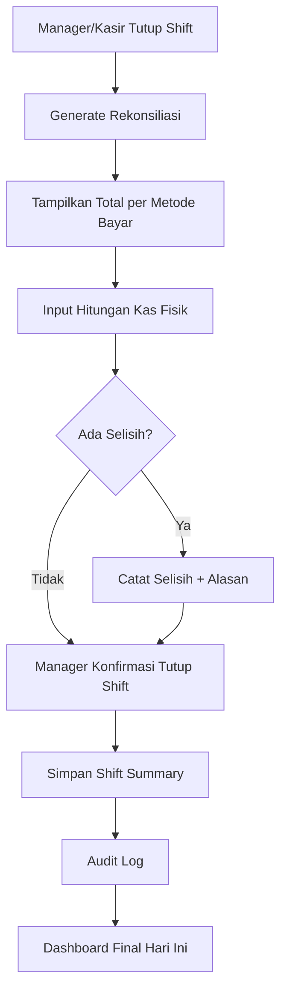

---

## 8. Authentication & Authorization Flow

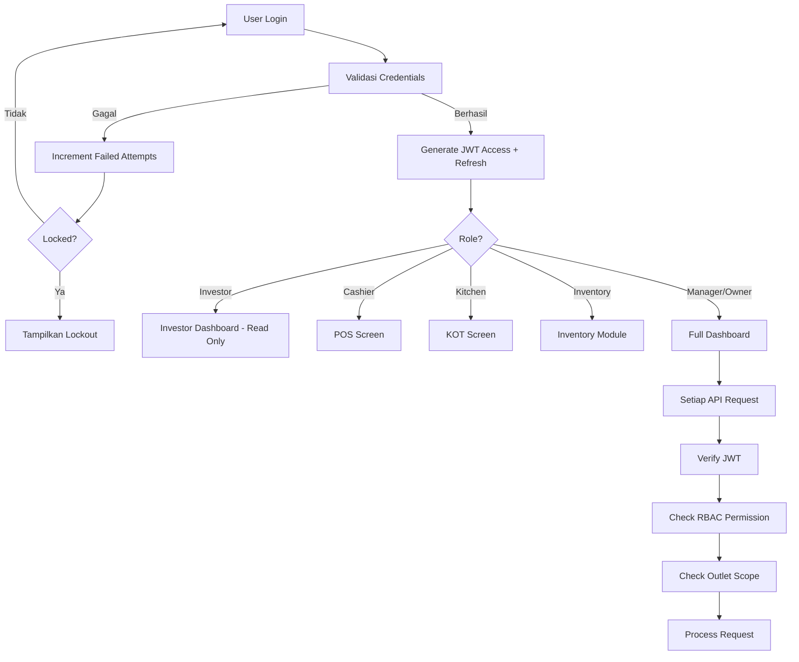

---

## 9. Report Generation Flow

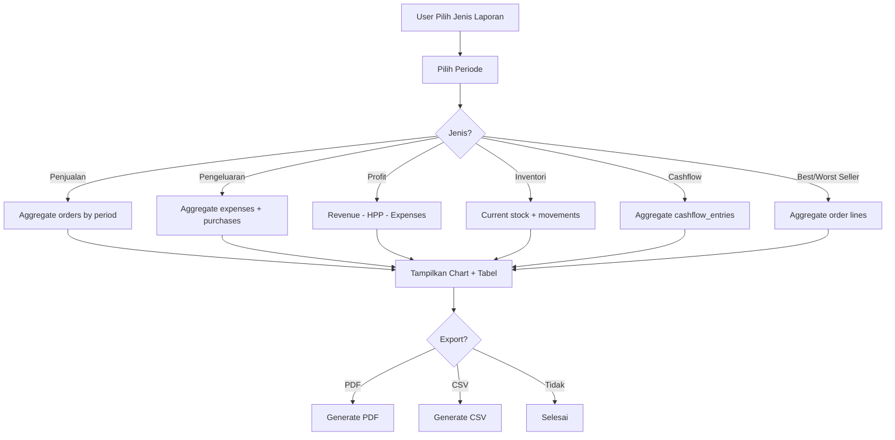

---

## 10. Notification Flow

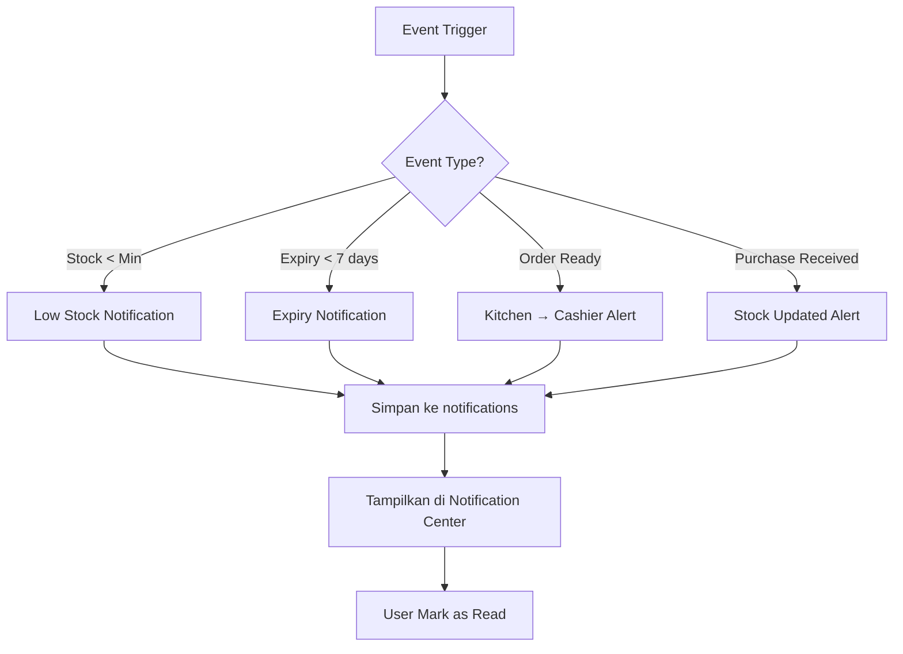

---

## 11. Daily Operations Timeline

```
05:00 ─── Staff datang, clock in
05:30 ─── Cek stok bahan pagi
06:00 ─── Produksi batch (Gendum kuah) jika perlu
07:00 ─── SHIFT PAGI BUKA — POS aktif (Gendum Kuah Tetelan)
14:00 ─── SHIFT PAGI TUTUP — rekonsiliasi
15:00 ─── Persiapan shift malam, produksi jika perlu
17:00 ─── SHIFT MALAM BUKA — POS aktif (Pecel Lele, Ayam Penyet)
22:00 ─── SHIFT MALAM TUTUP — rekonsiliasi
22:30 ─── Staff clock out
23:00 ─── Manager review dashboard harian
```

---

## 12. Event-Driven Flow (v1.1 — Business Event DNA)

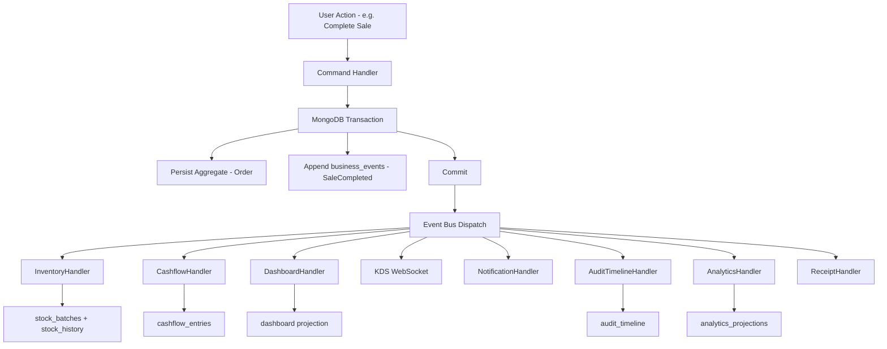

> **Business Event DNA:** Every action creates a permanent `business_events` record. Handlers produce all downstream effects — never duplicate input.

---

## 13. Approval Workflow Flow

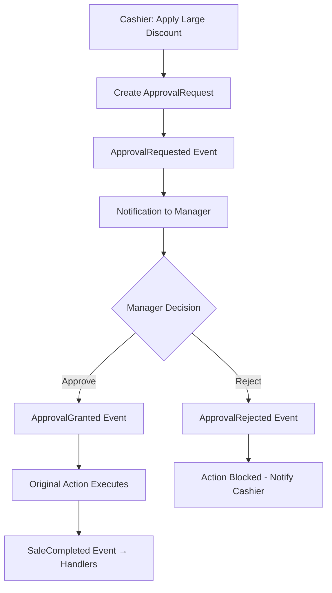

---

## 14. Offline POS Sync Flow

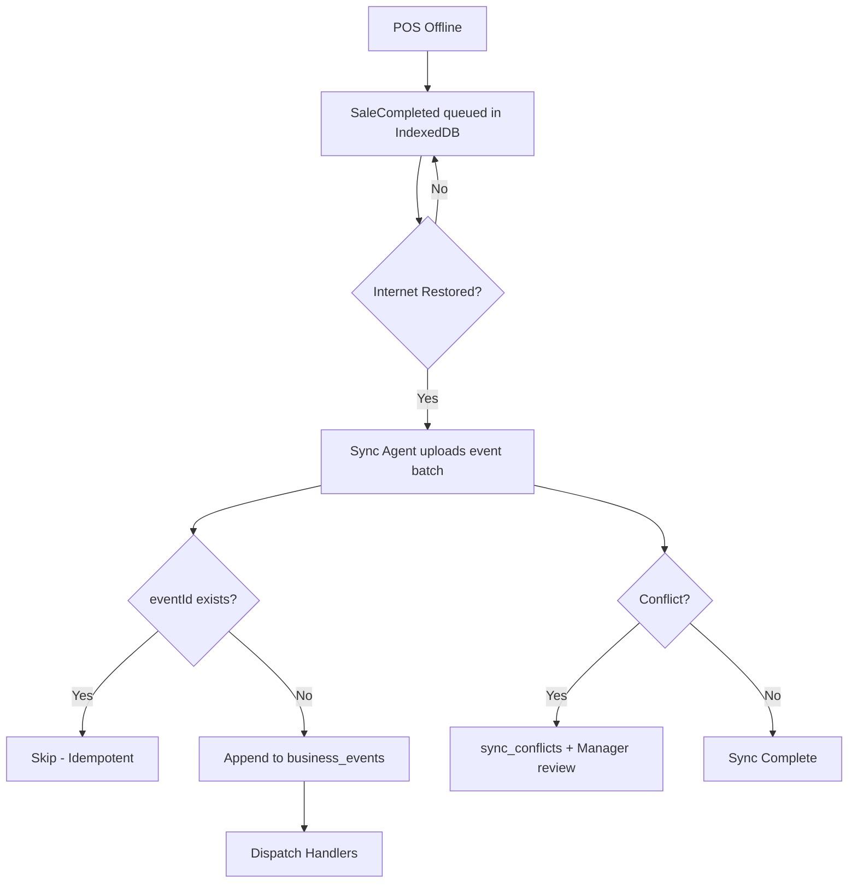

---

## 15. Daily Closing Flow

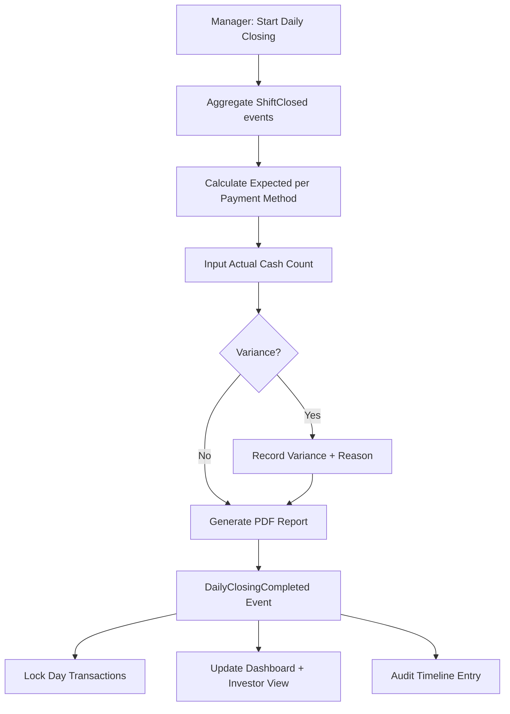
