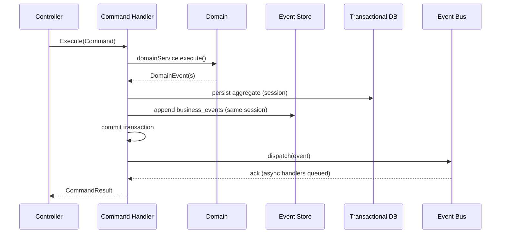
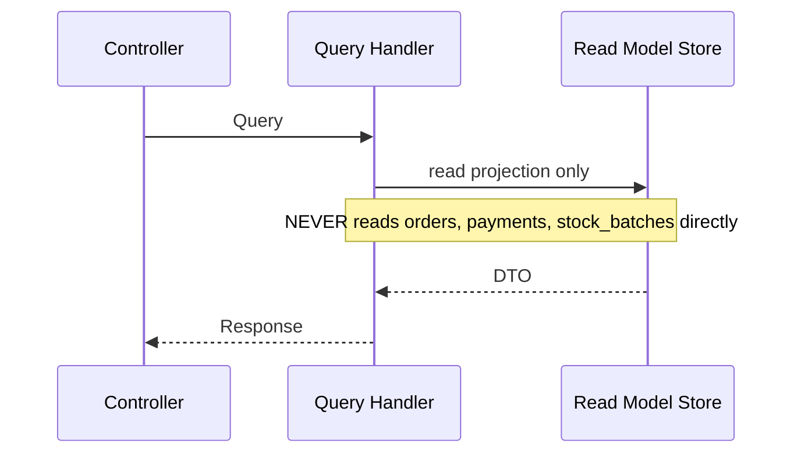

# Event Store Layer — Architecture Freeze

**Document ID:** WN-ARCH-012  
**Version:** 1.0.0 (Phase 0.5)  
**Status:** FROZEN — Architecture Contract

---

## 1. Layer Separation (Frozen)

```
┌─────────────────────────────────────────────────────────────────────────────┐
│                           PRESENTATION LAYER                                │
│  Controllers (orchestrators only) │ WebSocket (KDS) │ Webhooks (inbound)   │
└───────────────────────────────────────┬─────────────────────────────────────┘
                                        │ Commands / Queries
┌───────────────────────────────────────▼─────────────────────────────────────┐
│                           APPLICATION LAYER                                 │
│  Command Handlers │ Query Handlers │ Process Managers (Sagas) │ DTOs       │
└───────────────────────────────────────┬─────────────────────────────────────┘
                                        │
┌───────────────────────────────────────▼─────────────────────────────────────┐
│                             DOMAIN LAYER                                    │
│  Aggregates │ Value Objects (Money) │ Domain Services │ Domain Events      │
│  (PURE — zero framework imports)                                            │
└───────────────────────────────────────┬─────────────────────────────────────┘
                                        │ persists + publishes
┌───────────────────────────────────────▼─────────────────────────────────────┐
│                        INFRASTRUCTURE LAYER                                   │
│                                                                               │
│  ┌─────────────┐  ┌─────────────┐  ┌──────────────┐  ┌──────────────────┐  │
│  │ Event Store │  │  Event Bus  │  │Event Handlers│  │   Projections    │  │
│  │ (append)    │─►│ (dispatch)  │─►│ (consumers)  │─►│ (write models)   │  │
│  └─────────────┘  └─────────────┘  └──────────────┘  └────────┬─────────┘  │
│         │                              │                        │            │
│         │                              ▼                        ▼            │
│         │                    event_consumer_log          Read Model Stores   │
│         │                              │                        │            │
│  ┌──────▼──────┐              ┌───────▼───────┐       ┌───────▼─────────┐  │
│  │ Transactional│              │ Retry / DLQ   │       │ Query Repos     │  │
│  │ Collections  │              │ (BullMQ)      │       │ (read-only)     │  │
│  └─────────────┘              └───────────────┘       └─────────────────┘  │
│                                                                               │
│  Integrations │ Repositories │ MongoDB Sessions │ Backup │ Health            │
└───────────────────────────────────────────────────────────────────────────────┘
```

---

## 2. Component Responsibilities (Contract)

| Component | Responsibility | May Write | May Read |
|-----------|----------------|-----------|----------|
| **Command** | Express user intent; validated input DTO | — | Domain rules |
| **Command Handler** | Load aggregate, execute domain logic, persist, append event | Transactional collections, Event Store | Aggregates |
| **Domain** | Business rules, invariants, value objects | — | — |
| **Event Store** | Append-only `business_events`; source of truth | `business_events` only | `business_events` |
| **Event Bus** | Route events to registered handlers | Queue jobs | — |
| **Event Handler** | React to event; update projections; idempotent | Projections, Read Models, side-effect collections | Event payload |
| **Projection** | Denormalized write model built by single handler | Owned projection collection | Events |
| **Read Model** | Optimized query surface for UI/API | — (handlers only) | Projections |
| **Query Handler** | Serve reads from Read Models only | — | Read Models |
| **Process Manager** | Orchestrate multi-step sagas across handlers | Saga state | Events |

---

## 3. CQRS Flow (Frozen)

### Write Path (Command)



### Read Path (Query)



---

## 4. Mandatory Rules (Freeze Contract)

| # | Rule | Violation |
|---|------|-----------|
| R1 | Every state change originates from a Business Event | Architecture breach |
| R2 | Dashboard reads **only** Read Models / projections | Performance + consistency breach |
| R3 | POS menu/cart reads Read Models; writes via Commands | Coupling breach |
| R4 | Event Store is append-only; no update/delete API | Data integrity breach |
| R5 | Projections updated **only** by Event Handlers | CQRS breach |
| R6 | Reporting never queries transactional collections | Scalability breach |
| R7 | Domain layer has no Mongoose, Express, or BullMQ imports | Clean Architecture breach |
| R8 | Controllers orchestrate only; no business logic | Layer breach |

---

## 5. Collection Classification

| Type | Examples | Written By | Read By |
|------|----------|------------|---------|
| **Event Store** | `business_events` | Command Handler (append) | Replay, Analytics, Audit |
| **Transactional** | `orders`, `purchase_orders`, `approval_requests` | Command Handler | Command Handler (load aggregate) |
| **Projection** | `projection_sales_daily`, `projection_inventory_snapshot` | Event Handlers | Query Handlers |
| **Read Model** | `read_dashboard_outlet`, `read_pos_menu` | Event Handlers | POS, Dashboard, KDS |
| **Saga State** | `saga_processes` | Process Manager | Process Manager |
| **System** | `event_consumer_log`, `backup_jobs` | Infrastructure | Health, Ops |

---

## 6. Related Documents

| Document | Path |
|----------|------|
| Event Metadata Standard | [13-event-metadata-standard.md](./13-event-metadata-standard.md) |
| Event Versioning | [14-event-versioning-strategy.md](./14-event-versioning-strategy.md) |
| Projection Strategy | [15-projection-strategy.md](./15-projection-strategy.md) |
| Read Model Strategy | [16-read-model-strategy.md](./16-read-model-strategy.md) |
| Transaction Boundaries | [22-transaction-boundaries.md](./22-transaction-boundaries.md) |
| Saga / Process Manager | [19-saga-process-manager.md](./19-saga-process-manager.md) |
