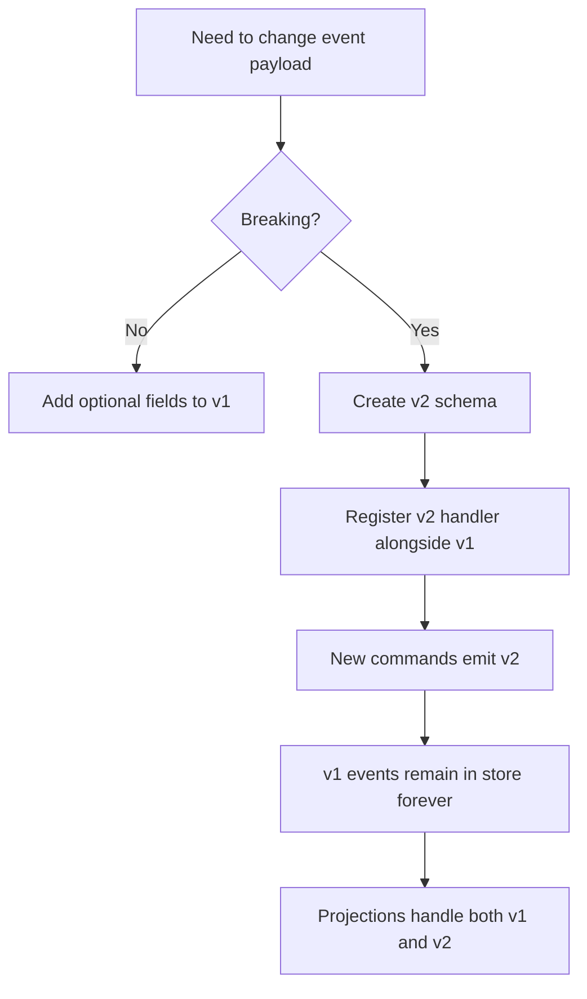

# Event Versioning Strategy — Architecture Freeze

**Document ID:** WN-ARCH-014  
**Version:** 1.0.0 (Phase 0.5)  
**Status:** FROZEN

---

## 1. Naming Convention (Frozen)

```
{eventName} v{eventVersion}
```

| Field | Format | Example |
|-------|--------|---------|
| `eventName` | PascalCase, **Past Tense** | `SaleCompleted` |
| `eventVersion` | Positive integer starting at 1 | `1` |

**Display:** `SaleCompleted v1`  
**Registry key:** `SaleCompleted:1`  
**Code constant:** `EVENT_SALE_COMPLETED_V1`

---

## 2. Versioning Rules

| Rule | Detail |
|------|--------|
| V1 at introduction | Every new event starts at `eventVersion: 1` |
| Breaking change → new version | Add `SaleCompleted v2`; v1 remains valid forever |
| Non-breaking change → same version | Add optional payload fields only if consumers tolerate |
| Old versions immutable | Never modify JSON Schema of published version |
| Consumers declare supported versions | Handler registry: `SaleCompleted: [1, 2]` |
| Replay uses original version | Historical events replayed with their stored version |

---

## 3. What Constitutes a Breaking Change

| Breaking | Non-Breaking |
|----------|--------------|
| Remove payload field | Add optional field |
| Change field type | Add new enum value (if consumers ignore unknown) |
| Rename payload field | Add deprecated alias in new version |
| Change semantic meaning | Add documentation clarification |
| Change Money precision rules | — |

---

## 4. Version Migration Strategy



### Upcaster Pattern (Replay)

For projection rebuilds, optional upcasters transform v1 → v2 in memory:

```
SaleCompleted v1 → upcast → SaleCompleted v2 shape → projection handler
```

Upcasters live in `shared/events/upcasters/`.

---

## 5. Event Registry (Frozen Location)

```
shared/events/
├── registry.ts              # Map<"EventName:version", Schema>
├── schemas/
│   ├── SaleCompleted.v1.json
│   ├── SaleCompleted.v2.json   # when needed
│   └── ...
└── upcasters/
    └── SaleCompleted.v1-to-v2.ts
```

---

## 6. Handler Version Binding

```typescript
// Handler declares supported versions
@EventHandler('SaleCompleted', [1, 2])
class InventoryOnSaleHandler { ... }
```

| Scenario | Behavior |
|----------|----------|
| Handler supports v1, event is v1 | Process |
| Handler supports v1,v2, event is v2 | Process |
| Handler supports v1 only, event is v2 | Skip + log warning OR delegate to v2 handler |
| No handler for version | Dead letter queue + alert |

---

## 7. API / Export Versioning

Event export API returns raw stored version. Clients must handle multiple versions.

```
GET /api/v1/analytics/events?eventName=SaleCompleted
→ returns mix of v1 and v2 events with eventVersion field
```

---

## 8. Deprecation Policy

| Phase | Action |
|-------|--------|
| Introduce v2 | v1 handlers remain active |
| T+3 months | New writes use v2 only |
| T+12 months | v1 handlers marked deprecated (still process historical) |
| Never | Delete v1 events from store |

---

## 9. Related

- [13-event-metadata-standard.md](./13-event-metadata-standard.md)
- [18-event-naming-convention.md](./18-event-naming-convention.md)
- [17-domain-event-catalog.md](./17-domain-event-catalog.md)
