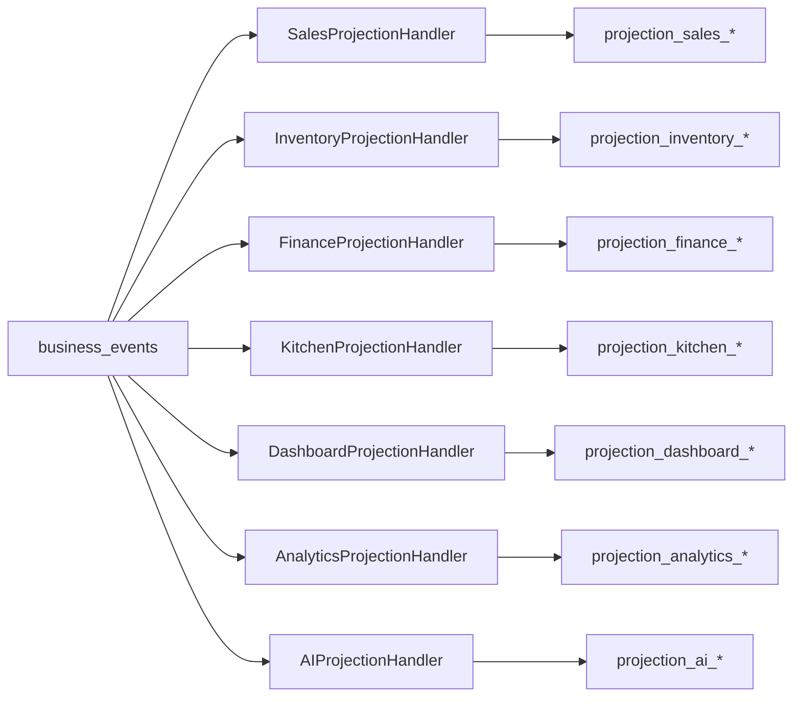

# Projection Strategy — Architecture Freeze

**Document ID:** WN-ARCH-015  
**Version:** 1.0.0 (Phase 0.5)  
**Status:** FROZEN

---

## 1. Principle

> Projections are **write models for queries**, built **exclusively** by Event Handlers.  
> No Command Handler, Controller, or cron job may write to projection collections.

---

## 2. Projection Domains (Frozen)

| Domain | Collection Prefix | Owner Handler(s) | Source Events |
|--------|-------------------|------------------|---------------|
| **Sales** | `projection_sales_*` | SalesProjectionHandler | Sale*, Order*, Refund* |
| **Inventory** | `projection_inventory_*` | InventoryProjectionHandler | Inventory*, Production*, PurchaseReceived |
| **Finance** | `projection_finance_*` | FinanceProjectionHandler | Sale*, Purchase*, Expense*, Payroll*, Payment* |
| **Customer** | `projection_customer_*` | CustomerProjectionHandler | Sale*, Customer* (future CRM) |
| **Kitchen** | `projection_kitchen_*` | KitchenProjectionHandler | Sale*, OrderItem*, KDS* |
| **Dashboard** | `projection_dashboard_*` | DashboardProjectionHandler | All financial + operational |
| **Analytics** | `projection_analytics_*` | AnalyticsProjectionHandler | All events (filtered) |
| **AI** | `projection_ai_*` | AIProjectionHandler | All events (feature-flagged) |

---

## 3. Projection Collection Catalog

### Sales

| Collection | Purpose | Key Fields |
|------------|---------|------------|
| `projection_sales_daily` | Daily sales per outlet | outletId, date, totalSales, orderCount, byPaymentMethod |
| `projection_sales_hourly` | Hourly breakdown | outletId, date, hour, totalSales |
| `projection_sales_by_item` | Item performance | outletId, menuItemId, period, qty, revenue, profit |
| `projection_sales_by_shift` | Shift performance | shiftId, totalSales, orderCount |

### Inventory

| Collection | Purpose | Key Fields |
|------------|---------|------------|
| `projection_inventory_snapshot` | Current stock view | outletId, warehouseId, itemId, qty, value |
| `projection_inventory_movement` | Movement summary | outletId, itemId, period, in, out, waste |
| `projection_inventory_valuation` | Stock valuation | outletId, date, totalValue |

### Finance

| Collection | Purpose | Key Fields |
|------------|---------|------------|
| `projection_finance_daily` | Daily P&L | outletId, date, revenue, hpp, expenses, profit |
| `projection_finance_cashflow` | Cashflow by method | outletId, date, method, in, out, net |
| `projection_finance_ledger_summary` | Category totals | outletId, period, category, amount |

### Customer (CRM-ready)

| Collection | Purpose | Key Fields |
|------------|---------|------------|
| `projection_customer_spend` | Spend per customer | customerId, period, totalSpend, visitCount |
| `projection_customer_frequency` | Visit patterns | customerId, lastVisit, avgInterval |

### Kitchen

| Collection | Purpose | Key Fields |
|------------|---------|------------|
| `projection_kitchen_queue` | Active tickets | outletId, orderId, items, status, waitSeconds |
| `projection_kitchen_performance` | Prep times | outletId, date, avgPrepTime, itemsCompleted |

### Dashboard

| Collection | Purpose | Key Fields |
|------------|---------|------------|
| `projection_dashboard_outlet_today` | Today KPIs (materialized) | outletId, sales, profit, expenses, lowStockCount |
| `projection_dashboard_alerts` | Active alerts | outletId, alerts[] |

### Analytics

| Collection | Purpose | Key Fields |
|------------|---------|------------|
| `projection_analytics_demand` | Demand features | outletId, itemId, hour, dayOfWeek, avgQty |
| `projection_analytics_price_trend` | Price trends | itemId, supplierId, period, avgPrice |

### AI

| Collection | Purpose | Key Fields |
|------------|---------|------------|
| `projection_ai_features` | ML feature vectors | scopeId, featureSet, computedAt |
| `projection_ai_anomalies` | Detected anomalies | outletId, type, score, detectedAt |

---

## 4. Projection Update Rules

| Rule | Detail |
|------|--------|
| Idempotent | Handler checks `event_consumer_log` before write |
| Upsert by key | Projections use deterministic `_id` or compound unique key |
| At-least-once | Duplicate delivery safe via idempotency |
| No cross-projection joins at write | Each handler owns its collections |
| Rebuild | Drop projection + replay `business_events` from sequence 0 |

---

## 5. Projection Rebuild Procedure (Frozen)

```
1. STOP handlers for target projection (feature flag)
2. TRUNCATE projection collection(s)
3. REPLAY business_events ORDER BY outletId, sequenceNumber
4. VERIFY checksum vs transactional aggregates (reconciliation script)
5. RESUME handlers
```

---

## 6. Diagram



---

## 7. Related

- [16-read-model-strategy.md](./16-read-model-strategy.md)
- [19-saga-process-manager.md](./19-saga-process-manager.md)
