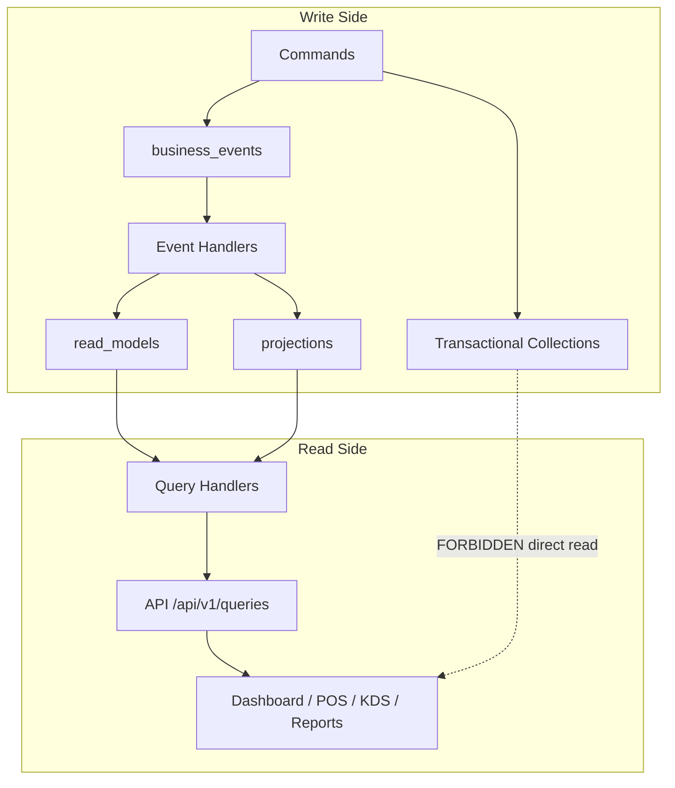

# Read Model Strategy — Architecture Freeze

**Document ID:** WN-ARCH-016  
**Version:** 1.0.0 (Phase 0.5)  
**Status:** FROZEN

---

## 1. Principle

> Read Models are the **only** data source for UI queries, reports, and dashboards.  
> Transactional collections (`orders`, `payments`, `stock_batches`) are **write-side only**.

| Consumer | Allowed Read Source | Forbidden |
|----------|---------------------|-----------|
| Dashboard | `projection_dashboard_*`, `read_dashboard_*` | `orders`, `cashflow_entries` |
| POS menu | `read_pos_menu` | `menu_items` direct (except command load) |
| POS cart totals | `read_pos_pricing` (optional cache) | — |
| KDS | `projection_kitchen_queue` | `orders` |
| Reports | `projection_sales_*`, `projection_finance_*` | transactional |
| Investor | `read_investor_*` | all transactional |
| Inventory UI list | `read_inventory_list` | `inventory_items` + `stock_batches` join |

**Exception:** Command Handlers may read transactional collections to load aggregates for writes.

---

## 2. Read Model vs Projection

| Aspect | Projection | Read Model |
|--------|------------|------------|
| Purpose | Aggregated analytics | UI-optimized document |
| Granularity | Often summarized | Often denormalized per screen |
| Builder | Event Handler | Event Handler (may wrap projection) |
| Collection prefix | `projection_*` | `read_*` |
| Example | `projection_sales_daily` | `read_dashboard_outlet_today` |

Read Models may **compose** from multiple projections in a single handler — but still event-driven.

---

## 3. Read Model Catalog (Frozen)

| Collection | Screen | Refresh Trigger |
|------------|--------|-----------------|
| `read_dashboard_outlet_today` | Owner/Manager dashboard | Sale*, Expense*, ShiftClosed, DailyClosing* |
| `read_dashboard_outlet_alerts` | Dashboard alert cards | LowStock*, Expiry*, Approval* |
| `read_pos_menu` | POS item grid | MenuItem*, RecipePublished, PriceChanged |
| `read_pos_shift_status` | POS header bar | ShiftOpened, ShiftClosed |
| `read_kds_board` | KDS full screen | Sale*, OrderItem*, Kitchen* |
| `read_inventory_list` | Inventory management | Inventory* |
| `read_inventory_item_detail` | Item detail drawer | Inventory*, PurchasePrice* |
| `read_approval_inbox` | Manager approvals | Approval* |
| `read_daily_closing_preview` | Closing wizard | ShiftClosed, Sale* |
| `read_investor_summary` | Investor dashboard | Finance projections |
| `read_audit_timeline` | Audit timeline UI | ALL events (via AuditTimelineHandler) |
| `read_notification_inbox` | Notification center | Notification* |
| `read_health_dashboard` | System health | SystemHealth*, Backup* |

---

## 4. Query Handler Pattern (Frozen)

```typescript
// ALLOWED
class GetDashboardTodayQueryHandler {
  async execute(query: GetDashboardTodayQuery) {
    return readDashboardRepo.findByOutlet(query.outletId);
  }
}

// FORBIDDEN
class GetDashboardTodayQueryHandler {
  async execute(query) {
    return db.orders.aggregate([...]); // ❌ NEVER
  }
}
```

---

## 5. Staleness & Consistency

| Model | Consistency | Max Staleness |
|-------|-------------|---------------|
| Dashboard KPIs | Eventual | < 2 seconds (async handler) |
| KDS queue | Eventual | < 500ms (WebSocket push on handler complete) |
| POS menu | Eventual | < 5 seconds |
| Reports (daily) | Eventual | < 10 seconds after last event |
| Investor | Eventual | < 30 seconds acceptable |

POS offline: Read Models synced as part of sync bundle (last known server state + local events).

---

## 6. Caching Layer (Optional)

| Layer | Technology | Invalidation |
|-------|------------|--------------|
| API response cache | Redis (future) | On read model update event |
| POS menu | IndexedDB local copy | On sync |
| Dashboard | TanStack Query staleTime 30s | Background refetch |

Cache is **downstream** of Read Models — never bypasses them.

---

## 7. Diagram



---

## 8. Related

- [15-projection-strategy.md](./15-projection-strategy.md)
- [12-event-store-layer.md](./12-event-store-layer.md)
