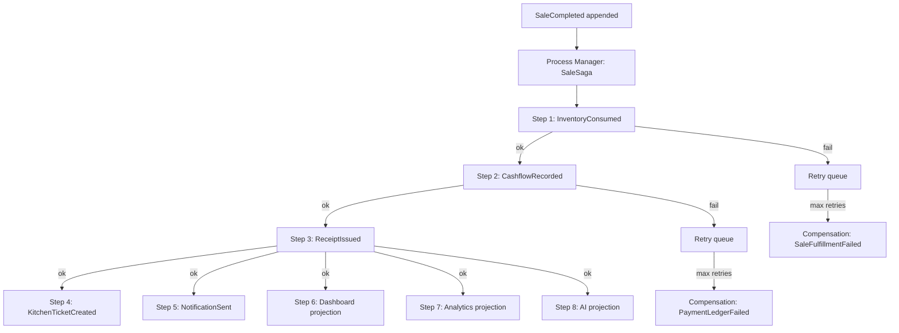

# Saga / Process Manager — Architecture Freeze

**Document ID:** WN-ARCH-019  
**Version:** 1.0.0 (Phase 0.5)  
**Status:** FROZEN

---

## 1. Principle

> The primary Business Event is **never rolled back**.  
> If downstream handlers fail, use **retry + compensation events** — not transaction rollback of the event store.

---

## 2. SaleCompleted Saga (Reference Flow)



---

## 3. Saga State Collection

#### `saga_processes`

| Field | Type | Description |
|-------|------|-------------|
| _id | ObjectId | PK |
| sagaId | string | UUID |
| sagaType | string | SaleCompletedSaga, PurchaseReceivedSaga |
| correlationId | string | Links to originating event |
| triggerEventId | string | business_events.eventId |
| status | string | running, completed, failed, compensating |
| currentStep | number | |
| steps | array | `{ name, status, attempts, lastError, completedAt }` |
| createdAt | Date | |
| updatedAt | Date | |

**Indexes:** `{ sagaId: 1 }` unique, `{ triggerEventId: 1 }`, `{ status: 1, updatedAt: 1 }`

---

## 4. Retry Strategy (Frozen)

| Parameter | Value |
|-----------|-------|
| Max attempts | 5 |
| Backoff | Exponential: 1s, 2s, 4s, 8s, 16s |
| Queue | BullMQ `event-handlers` queue |
| Idempotency | `event_consumer_log` per handler per eventId |
| Dead letter | After max retries → `event_dead_letter` + `SystemHealthAlert` |
| Manual replay | Admin API to requeue from dead letter |

---

## 5. Compensation Strategy

| Failed Step | Compensation Event | Action |
|-------------|-------------------|--------|
| Inventory after Sale | `SaleFulfillmentFailed` | Flag order; notify Manager; block auto-close |
| Ledger after Sale | `PaymentLedgerFailed` | Alert Finance; queue manual reconciliation |
| Receipt after Sale | `ReceiptDeliveryFailed` | Retry print/digital; non-blocking |
| Projection failure | None (eventual) | Replay projection from event stream |

**Never:** Delete `SaleCompleted` from event store.

---

## 6. Saga Catalog

| Saga Type | Trigger Event | Steps |
|-----------|---------------|-------|
| `SaleCompletedSaga` | SaleCompleted | Inventory → Ledger → Receipt → KDS → Notify → Projections |
| `PurchaseReceivedSaga` | PurchaseReceived | Inventory → Ledger → PriceHistory → Notify → Projections |
| `ProductionCompletedSaga` | ProductionCompleted | Inventory IN/OUT → Cost → Projections |
| `DailyClosingSaga` | DailyClosingStarted | Aggregate → Reconcile → PDF → Lock → Projections |
| `PayrollPaidSaga` | PayrollPaid | Ledger → Expense → Notify |
| `RefundSaga` | SaleRefunded | Reverse Inventory → Reverse Ledger → Receipt → Projections |

---

## 7. Sync vs Async Boundary

| Step | Execution | Reason |
|------|-----------|--------|
| Append `business_events` | **Sync** (in command transaction) | Source of truth |
| Persist aggregate | **Sync** (same transaction) | Consistency |
| Handler dispatch | **Async** (queue) | Performance |
| Projections | **Async** (eventual) | Scalability |
| KDS WebSocket push | **Async** (after KitchenProjection) | Real-time |
| Receipt print | **Async** (non-blocking) | Hardware latency |

---

## 8. Process Manager Location

```
backend/src/application/process-managers/
├── SaleCompletedSaga.ts
├── PurchaseReceivedSaga.ts
├── ProductionCompletedSaga.ts
├── DailyClosingSaga.ts
├── RefundSaga.ts
└── PayrollPaidSaga.ts
```

---

## 9. Related

- [22-transaction-boundaries.md](./22-transaction-boundaries.md)
- [12-event-store-layer.md](./12-event-store-layer.md)
