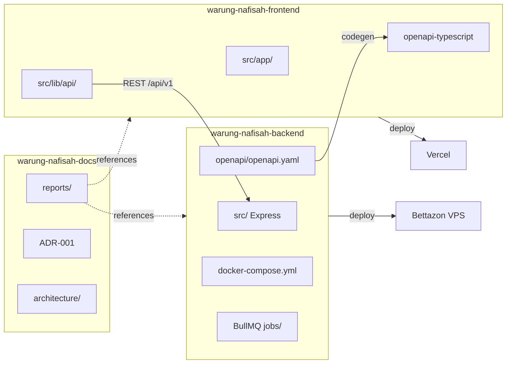

# ADR-001 — Multi-Repository Strategy

**Document ID:** WN-ADR-001  
**Status:** APPROVED  
**Date:** 2026-07-01  
**Supersedes:** Monorepo strategy (Phase 1.1 repository foundation)  
**Decision Makers:** Architecture Review Board, Soemanto Engineering

---

## 1. Latar Belakang

Warung Nafisah ERP awalnya direncanakan sebagai **monorepo** npm workspaces (`backend/`, `frontend/`, `shared/`, `core/`) dalam satu repository `warung-nafisah`.

Pendekatan tersebut cocok untuk tim kecil yang mengembangkan semua layer secara simultan, tetapi **tidak selaras** dengan standar deployment perusahaan Soemanto dan menambah kompleksitas operasional yang tidak diperlukan untuk skala awal proyek.

---

## 2. Masalah Monorepo

| Masalah | Dampak |
|---------|--------|
| **Deployment coupling** | Frontend (Vercel) dan Backend (VPS Docker) memiliki lifecycle berbeda, tetapi terikat satu repo |
| **CI/CD complexity** | Satu pipeline harus memahami semua workspace; build frontend tidak perlu saat hanya backend berubah |
| **Shared source code** | Package `shared/` menciptakan coupling compile-time antar frontend dan backend |
| **Docker scope creep** | Frontend ikut terlibat dalam strategi container padahal deploy ke Vercel |
| **Onboarding friction** | Developer docs/infra/frontend/backend tercampur dalam satu root |
| **Ecosystem mismatch** | Proyek Soemanto lain menggunakan **Vercel + Docker VPS** pattern |

---

## 3. Keputusan

**WARUNG NAFISAH ERP menggunakan Multi-Repository Architecture.**

Tiga repository terpisah:

| # | Repository | Technology | Deployment |
|---|------------|------------|------------|
| 1 | `warung-nafisah-backend` | Node.js, Express, MongoDB, Redis, BullMQ | Docker → **Bettazon VPS** |
| 2 | `warung-nafisah-frontend` | Next.js, Material UI | **Vercel** (no Docker) |
| 3 | `warung-nafisah-docs` | Markdown documentation | GitHub (read-only reference) |

---

## 4. Alasan Perubahan

1. **Selaras dengan ecosystem Soemanto** — Frontend Vercel, Backend Docker VPS adalah standar perusahaan
2. **Simplified deployment** — Setiap repo deploy independen
3. **Clear ownership** — Backend team vs Frontend team vs Documentation
4. **Independent versioning** — Semantic version per repository
5. **Reduced build surface** — CI hanya build apa yang berubah

---

## 5. Keuntungan

| Area | Benefit |
|------|---------|
| Deployment | Frontend auto-deploy Vercel; Backend `docker compose` di VPS |
| Scaling | Scale backend workers (BullMQ) tanpa menyentuh frontend |
| Security | VPS credentials terisolasi dari frontend repo |
| DX | Clone hanya repo yang dibutuhkan |
| Contract clarity | OpenAPI sebagai single source of truth — bukan shared npm package |

---

## 6. Konsekuensi

### Yang Berubah

| Before (Monorepo) | After (Multi-Repo) |
|-------------------|-------------------|
| `shared/` npm package | **OpenAPI + REST API** contract |
| `@warung-nafisah/core` workspace | **Internal `src/core/`** di backend repo |
| Root `package.json` workspaces | **Independent** `package.json` per repo |
| Single `docker-compose.yml` (all services) | **Backend repo only** — MongoDB, Redis, BullMQ, API |
| Frontend Dockerfile | **Dihapus** — Vercel build |
| `reports/` di root monorepo | **`warung-nafisah-docs`** repository |
| Backend port 4000 (draft) | **Port 5000** (development standard) |
| Frontend port 3003 (draft) | **Port 3000** (development standard) |

### Yang TIDAK Berubah

- Clean Architecture, CQRS, Event-Driven DNA
- 62 business events, 64 collections, 72 error codes
- `/api/v1` versioning, command/query split
- 4-level hierarchy, RBAC 12 roles
- Semua domain, event, dan security contracts

### Migration Actions (Blueprint Only — No Code Yet)

1. Abandon monorepo `warung-nafisah` as implementation target
2. Initialize three Git repositories
3. Move `reports/` → `warung-nafisah-docs`
4. Scaffold `warung-nafisah-backend` with frozen backend folder structure
5. Scaffold `warung-nafisah-frontend` with frozen frontend folder structure
6. Publish OpenAPI spec from backend; frontend generates typed client

---

## 7. Shared Contract (Bukan Shared Source Code)

Komunikasi Frontend ↔ Backend **hanya** melalui:

| Mechanism | Detail |
|-----------|--------|
| **OpenAPI Specification** | Canonical contract — `warung-nafisah-backend/openapi/openapi.yaml` |
| **REST API** | HTTPS JSON over `/api/v1` |
| **Typed DTO** | Frontend generates types via `openapi-typescript` or similar |
| **Versioned API** | `/api/v1` frozen; breaking changes → `/api/v2` |

**Dilarang:** npm package shared antar repository, git submodule untuk types, copy-paste manual DTO tanpa generation.

### Contract Workflow

```
Backend implements endpoint
        ↓
OpenAPI spec updated (CI enforced)
        ↓
Spec published (artifact / docs repo mirror)
        ↓
Frontend runs codegen → typed API client
        ↓
Contract tests validate request/response
```

---

## 8. Deployment Architecture

### Development

```
┌─────────────────────┐
│  localhost:3000     │  warung-nafisah-frontend (next dev)
│  Next.js + MUI      │
└──────────┬──────────┘
           │ HTTP REST /api/v1
           ▼
┌─────────────────────┐
│  localhost:5000     │  warung-nafisah-backend (express)
│  Express API        │
└──────────┬──────────┘
           │
     ┌─────┴─────┐
     ▼           ▼
┌─────────┐ ┌─────────┐
│ MongoDB │ │  Redis  │   docker compose (backend repo)
│  :27017 │ │  :6379  │
└─────────┘ └─────────┘
     │
     ▼
┌─────────┐
│ BullMQ  │   Worker container (backend repo)
│ Worker  │
└─────────┘
```

### Production

```
┌─────────────────────┐
│      Vercel         │  warung-nafisah-frontend
│  (auto deploy)      │  NEXT_PUBLIC_API_URL → api.warungnafisah.id
└──────────┬──────────┘
           │ HTTPS
           ▼
┌─────────────────────┐
│   Bettazon VPS      │  warung-nafisah-backend
│   Docker Compose    │
│  ┌───────────────┐  │
│  │ Nginx / API   │  │  :443 → Express :5000
│  ├───────────────┤  │
│  │ BullMQ Worker │  │
│  ├───────────────┤  │
│  │ MongoDB       │  │
│  ├───────────────┤  │
│  │ Redis         │  │
│  └───────────────┘  │
└─────────────────────┘
```

### Soemanto Deployment Standard

| Layer | Platform |
|-------|----------|
| Frontend | Vercel |
| Backend | Docker → VPS |
| Database | MongoDB Docker |
| Cache | Redis Docker |
| Worker | BullMQ Docker |

---

## 9. CI/CD Strategy

### Frontend (`warung-nafisah-frontend`)

| Trigger | Action |
|---------|--------|
| Push to `main` | Vercel auto-deploy production |
| Pull Request | Vercel preview deployment |
| CI (GitHub Actions) | Lint, typecheck, build, contract test vs OpenAPI |

**No Docker. No VPS deploy.**

### Backend (`warung-nafisah-backend`)

| Trigger | Action |
|---------|--------|
| Push to `main` | Build Docker image → push registry → deploy VPS via Compose |
| Pull Request | CI: lint, test, build image (no deploy) |
| Tag `v*` | Release image with semantic version |

### Docs (`warung-nafisah-docs`)

| Trigger | Action |
|---------|--------|
| Push to `main` | Validate markdown links, structure check |
| Optional | GitHub Pages for rendered docs |

---

## 10. Repository Diagram



---

## 11. Docker Scope

| Repository | Docker |
|------------|--------|
| `warung-nafisah-backend` | ✅ Dockerfile, docker-compose.yml, MongoDB, Redis, BullMQ, Nginx |
| `warung-nafisah-frontend` | ❌ No Dockerfile — Vercel native build |
| `warung-nafisah-docs` | ❌ No containers |

---

## 12. Related Documents

| Document | Path |
|----------|------|
| Folder Structure (revised) | [21-folder-structure-final.md](./21-folder-structure-final.md) |
| Deployment Architecture | [23-deployment-architecture.md](./23-deployment-architecture.md) |
| Development Setup | [../implementation/06-development-setup.md](../implementation/06-development-setup.md) |
| CI/CD Strategy | [../implementation/07-cicd-strategy.md](../implementation/07-cicd-strategy.md) |
| API Versioning | [../api/01-api-versioning-strategy.md](../api/01-api-versioning-strategy.md) |

---

## 13. Approval

| Role | Status | Date |
|------|--------|------|
| Architecture Review Board | ✅ APPROVED | 2026-07-01 |
| ADR-001 Effective | ✅ ACTIVE | 2026-07-01 |

**Monorepo strategy is officially superseded.**
