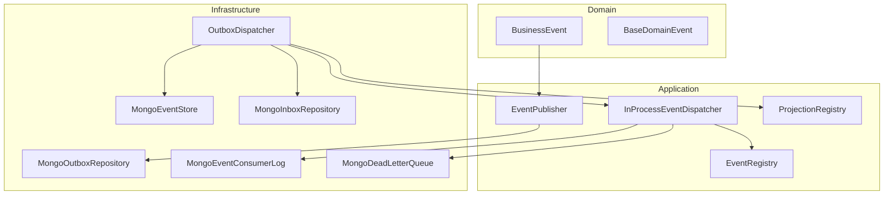
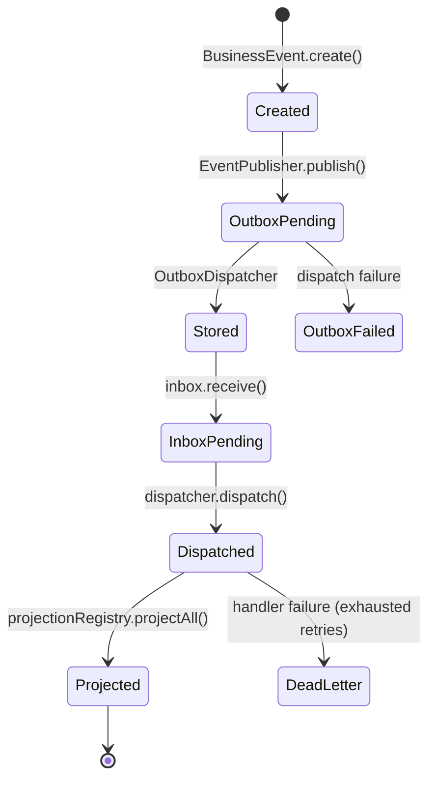

# ADR-003 — Business Event Platform

**Document ID:** WN-ADR-003  
**Status:** PROPOSED — Awaiting Approval  
**Date:** 2026-07-11  
**Depends On:** Sprint 2 (Core Domain), Sprint 3B (Persistence Framework)  
**Decision Makers:** Architecture Review Board, Soemanto Engineering

---

## 1. Context

Warung Nafisah ERP is built on the principle:

> **"Every business action creates exactly one permanent business event."**

Sprint 4 establishes the **Business Event Platform** — the shared infrastructure that all future business modules (POS, Inventory, Finance, etc.) will use to publish, persist, dispatch, and project domain events.

Prior sprints delivered domain primitives (`IDomainEvent`, `AggregateRoot`) and MongoDB persistence (transactions, UoW). This ADR records the architectural decisions for the event platform layer.

---

## 2. Decision

Adopt an **append-only, event-driven platform** with:

1. **Immutable Business Events** — never updated, never deleted
2. **Transactional Outbox** — events enqueued in the same MongoDB transaction as aggregate writes
3. **Inbox Pattern** — track received events before handler dispatch
4. **In-Process Dispatcher** — synchronous handler execution within the backend process (Phase 1)
5. **Idempotent Handlers** — `EventConsumerLog` keyed by `(eventId, handlerName)`
6. **Retry + Dead Letter** — transient failures retried; permanent failures routed to DLQ
7. **Generic Projection Framework** — pluggable read-model builders without business logic in Sprint 4

---

## 3. Rationale

| Decision | Why |
|----------|-----|
| Append-only store | Audit trail integrity; regulatory compliance; replay capability |
| Outbox pattern | Guarantees at-least-once publish when aggregate + event share a transaction |
| Inbox pattern | Separates receive from process; supports retry without re-append to store |
| In-process dispatch (now) | Simpler ops for MVP; no message broker dependency on Bettazon VPS |
| Consumer log idempotency | Handlers may see the same event more than once (at-least-once delivery) |
| DLQ + failed log | Operational visibility; manual replay path for poison messages |
| Generic projections | Business read models added per module without changing platform core |

---

## 4. Alternatives Considered

| Alternative | Rejected Because |
|-------------|------------------|
| Direct handler call (no outbox) | Loses atomicity between aggregate write and event publish |
| RabbitMQ / Kafka now | Operational complexity; VPS sizing; premature for current scale |
| Event update/delete | Violates audit DNA; breaks event sourcing replay |
| Handler idempotency only in memory | Lost on process restart; not durable |

---

## 5. Architecture

---

## 6. Event Lifecycle

---

## 7. Collections

| Collection | Write Pattern | Purpose |
|------------|---------------|---------|
| `business_events` | Append only | Canonical event store |
| `event_outbox` | Insert → status update | Transactional publish buffer |
| `event_inbox` | Insert → status update | Receive / process tracking |
| `event_consumer_log` | Insert once per handler | Idempotency |
| `event_dead_letter` | Append on failure | Poison message queue |
| `event_failed_log` | Append on failure | Operational audit |

---

## 8. Consequences

### Positive

- All modules share one event contract and dispatch pipeline
- Events survive process crashes (durable outbox + store)
- Handlers are safe under at-least-once delivery
- Clear upgrade path to external message broker (outbox poller → queue)

### Negative / Trade-offs

- In-process dispatch limits horizontal handler scaling until broker added
- Outbox poller must run (manual `dispatchPending()` or scheduled job in future sprint)
- Collection count increases (6 event-related collections)

---

## 9. Future Work (Out of Sprint 4)

- Background outbox poller job (BullMQ)
- External message broker adapter (RabbitMQ / Redis Streams)
- Business handlers: Inventory, Finance, POS
- Dashboard / Inventory / Finance projections
- Event replay tooling

---

## 10. Compliance

| Rule | Status |
|------|--------|
| Clean Architecture | ✅ Domain free of infrastructure |
| No business handlers in Sprint 4 | ✅ |
| No external broker in Sprint 4 | ✅ |
| Append-only events | ✅ |

---

**Approve with:** `ADR-003 Approved`
