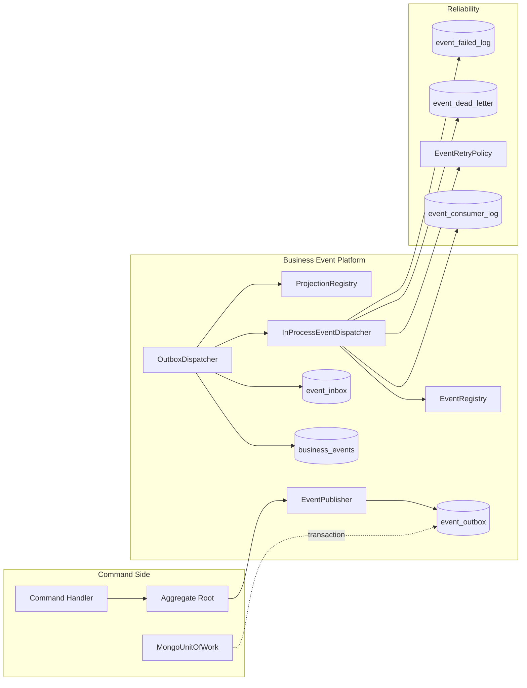
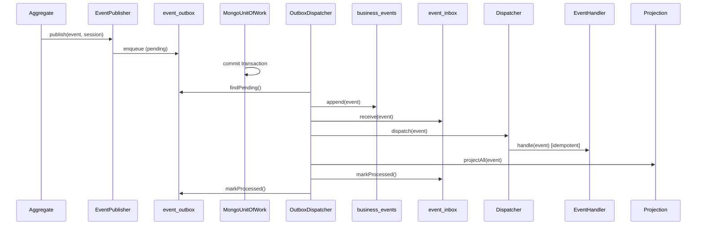
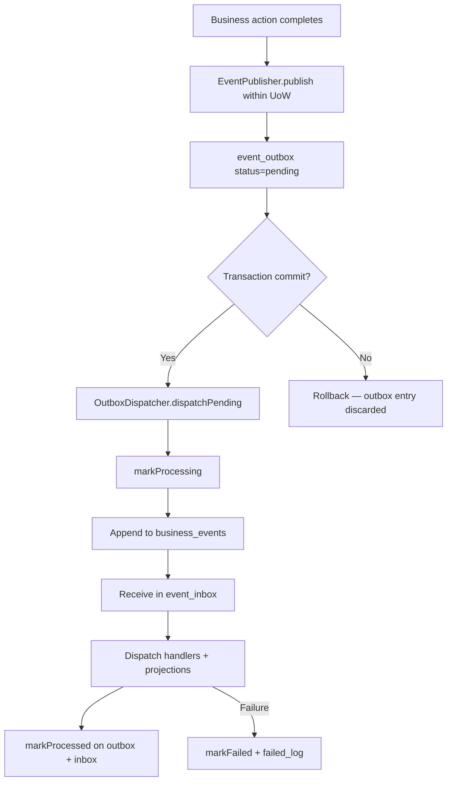
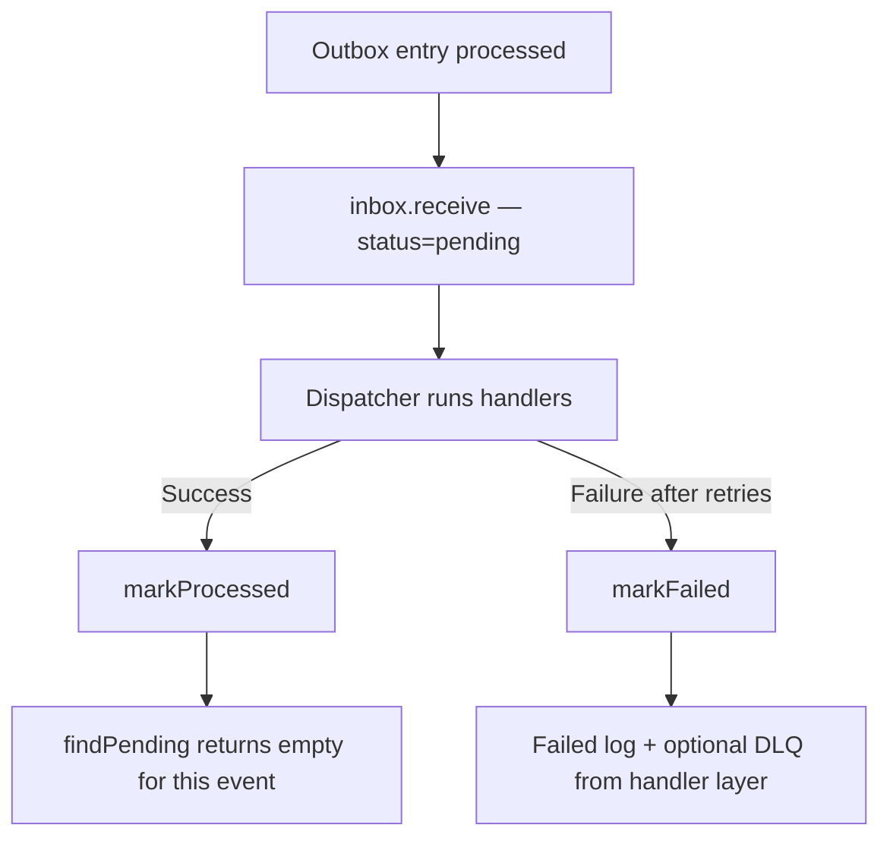
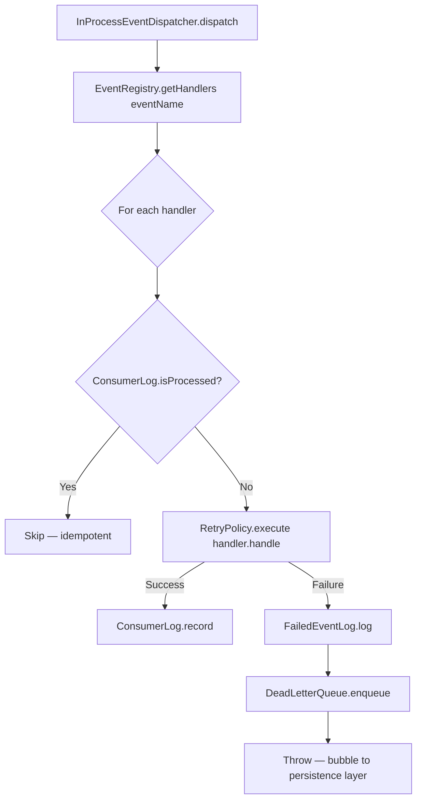
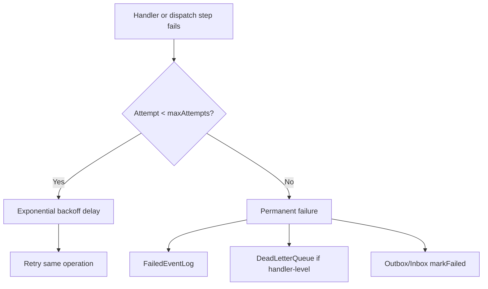
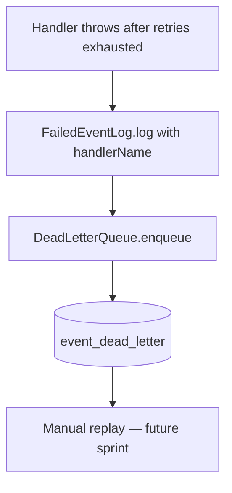
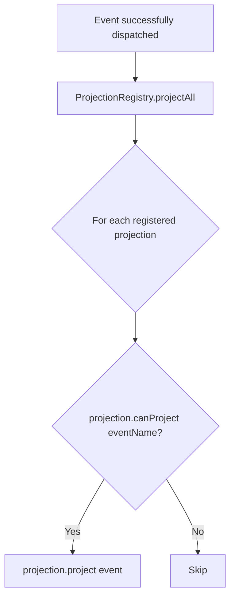
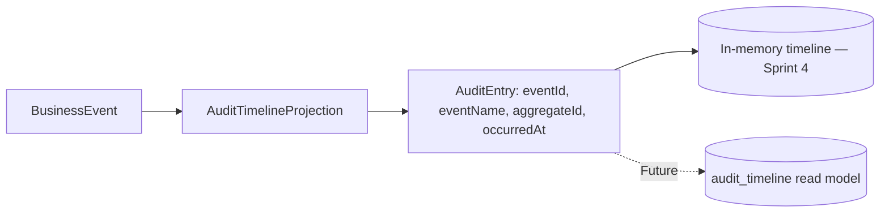

# Business Event Platform — Architecture

**Document ID:** WN-ARCH-EVENT-001  
**Version:** 0.9.0  
**Date:** 2026-07-11  
**Sprint:** 4 — Business Event Platform

---

## 1. Overview

The Business Event Platform is the shared Event-Driven Architecture foundation for Warung Nafisah ERP. It ensures every future business action produces exactly one immutable, append-only `BusinessEvent` that is durably stored, reliably dispatched, and safely projected.

**Platform only — no business module handlers in Sprint 4.**

---

## 2. Layer Map

| Layer | Path | Responsibility |
|-------|------|----------------|
| Domain | `backend/src/domain/events/` | Event primitives, immutability |
| Core | `backend/src/core/events/` | Ports (interfaces), retry policy |
| Application | `backend/src/application/events/` | Publisher, dispatcher, registry, projections |
| Infrastructure | `backend/src/infrastructure/events/` | MongoDB adapters, persistence orchestration |

---

## 3. Architecture Diagram

---

## 4. Event Lifecycle

**Immutability rules:**

- `BusinessEvent` is `Object.freeze()` at creation
- `business_events` — insert only, no update/delete APIs
- Payload and metadata are frozen recursively

---

## 5. Outbox Flow

**Why outbox:** Guarantees the event is not lost if the aggregate write commits but the process crashes before dispatch.

---

## 6. Inbox Flow

**Idempotent receive:** `inbox_${eventId}` — duplicate receive returns existing entry without error.

---

## 7. Dispatcher Flow

---

## 8. Retry Flow

**Default policy:** `maxAttempts: 2`, `baseDelayMs: 10` (configurable per platform instance).

---

## 9. Dead Letter Flow

DLQ entries store the full serialized event envelope for operational recovery.

---

## 10. Projection Flow

**Sprint 4 deliverable:** `AuditTimelineProjection` — generic in-memory audit timeline framework. No business-specific read models.

---

## 11. Audit Flow

Business modules will register domain-specific audit enrichments in future sprints without modifying the platform core.

---

## 12. MongoDB Collections

| Collection | Indexes | Notes |
|------------|---------|-------|
| `business_events` | `eventName`, `aggregateId`, `aggregateType` | `_id = eventId` |
| `event_outbox` | `eventId`, `status` | `_id = outbox_{eventId}` |
| `event_inbox` | `eventId`, `status` | `_id = inbox_{eventId}` |
| `event_consumer_log` | `eventId`, `handlerName` | `_id = {eventId}:{handlerName}` |
| `event_dead_letter` | `eventId`, `handlerName` | Append on failure |
| `event_failed_log` | `eventId` | All failure types |

---

## 13. Integration Points (Future Sprints)

| Consumer | Uses |
|----------|------|
| POS module | `EventPublisher`, `EventRegistry` |
| Inventory module | Handler + projection registration |
| Finance module | Handler + projection registration |
| Dashboard | Read projections (not built in Sprint 4) |
| Jobs / BullMQ | `OutboxDispatcher.dispatchPending()` poller |

---

## 14. Related Documents

- [ADR-003](./ADR-003-business-event-platform.md)
- [Implementation Report](../implementation/14-sprint4-business-event-platform.md)
- [Event-Driven Architecture](./09-event-driven-architecture.md)
- [Event Store Layer](./12-event-store-layer.md)
- [Projection Strategy](./15-projection-strategy.md)
