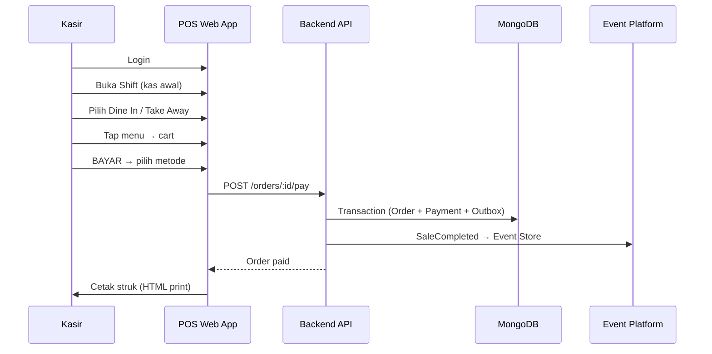

# Operational POS MVP — Business Document

**Document ID:** WN-BIZ-POS-001  
**Version:** 0.10.0  
**Date:** 2026-07-11  
**Sprint:** 4.5

---

## 1. Business Context

Warung Nafisah operates daily with increasing sales volume. Manual recording and revenue calculation are becoming operational bottlenecks. Sprint 4.5 delivers a **production-ready POS web app** for kasir use.

---

## 2. Transaction Flow



---

## 3. Wireframe (POS Register)

```
┌─────────────────────────────────────────────────────────────┐
│  WARUNG NAFISAH POS          [Dine In] [Take Away]  Kasir  │
├──────────────────────────────┬──────────────────────────────┤
│ [Pecel] [Model] [Minuman] [+]│  CART                        │
│                              │  Pecel Lele    x2   Rp36.000 │
│  🍗 Pecel Lele    Rp18.000   │  Es Teh        x1   Rp 5.000 │
│  🍗 Pecel Jumbo   Rp25.000   │  ─────────────────────────── │
│  🍜 Model Ayam    Rp15.000   │  TOTAL          Rp41.000     │
│  🥤 Es Teh        Rp 5.000   │  [        BAYAR        ]     │
└──────────────────────────────┴──────────────────────────────┘
```

---

## 4. Database (Minimum Collections)

| Collection | Purpose |
|------------|---------|
| `menus` | Master menu (nama, kategori, harga, status) |
| `orders` | Order header + embedded draft items |
| `order_items` | Line items (persisted on pay) |
| `payments` | Payment record per paid order |
| `shifts` | Kas awal / kas akhir per kasir |
| `order_sequences` | Daily human-readable number counter |
| `users` | Owner / Kasir accounts |

Event platform collections (`business_events`, `event_outbox`, etc.) unchanged from Sprint 4.

---

## 5. API Summary

| Method | Path | Role |
|--------|------|------|
| POST | `/auth/login` | Public |
| GET | `/menus` | Kasir, Owner |
| POST | `/orders` | Kasir |
| PUT | `/orders/:id/items` | Kasir |
| POST | `/orders/:id/pay` | Kasir |
| GET | `/orders/today` | Kasir, Owner |
| POST | `/shifts/open` | Kasir |
| POST | `/shifts/:id/close` | Kasir |
| GET | `/owner/dashboard/today` | Owner |

---

## 6. Order Lifecycle

| Status | Description | Sprint 4.5 |
|--------|-------------|------------|
| Draft | Kasir memilih menu, edit cart | ✅ |
| Paid | Tombol BAYAR ditekan | ✅ |
| Cancelled | Order dibatalkan | ✅ Domain ready |
| Preparing | Kitchen workflow | ⬜ Future |
| Ready | Pickup workflow | ⬜ Future |
| Completed | Full lifecycle | ⬜ Future |

---

## 7. Receipt Contents

- Logo (optional)
- Nama Warung
- Nomor Transaksi (WN-YYYYMMDD-NNNNNN)
- Tanggal & Kasir
- Daftar item (qty, harga, subtotal)
- Total & metode pembayaran
- Terima kasih

Print: HTML template via `window.print()` — 58mm / 80mm thermal compatible.

---

## 8. Future Upgrade Path → Full POS

| Phase | Capability |
|-------|------------|
| **4.5 (now)** | Operational sales, shift, receipt, owner omset hari ini |
| Sprint 5+ | Inventory deduction on SaleCompleted |
| Sprint 5+ | Recipe / BOM costing |
| Sprint 6+ | Kitchen Display (Preparing → Ready) |
| Sprint 6+ | Delivery workflow |
| Sprint 7+ | Finance integration, daily closing |
| Sprint 8+ | Full RBAC, approval workflows |
| Future | Payment gateway (Midtrans/Xendit) |
| Future | Offline-first / sync |

Architecture is designed for extension — `SaleCompleted` event is already published for future Inventory handler registration without changing POS core.

---

## 9. Related Documents

- [Implementation Report](../sprint4.5/implementation-report.md)
- [Business Event Platform](../architecture/business-event-platform.md)
- [ADR-003](../architecture/ADR-003-business-event-platform.md)
