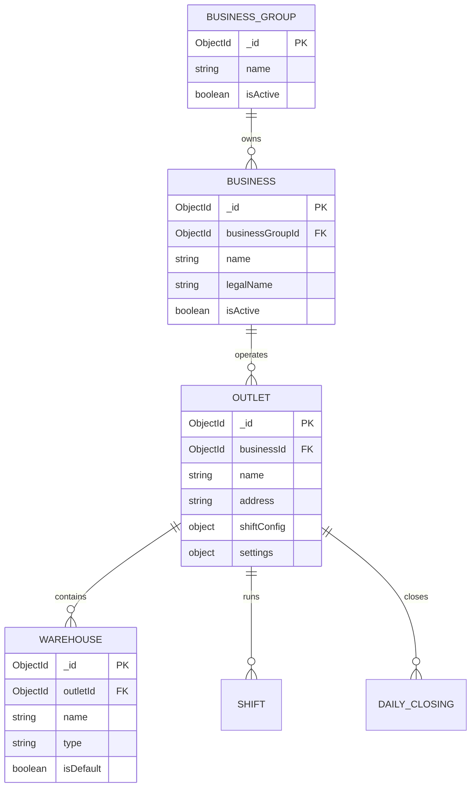
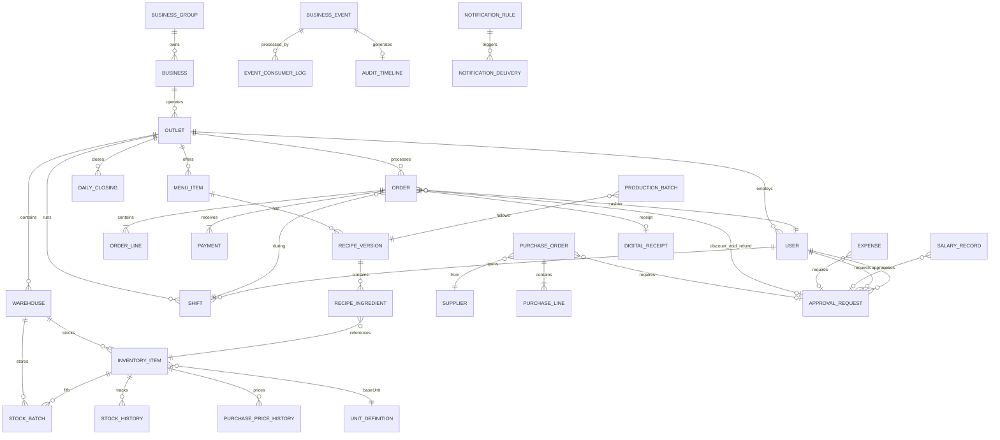
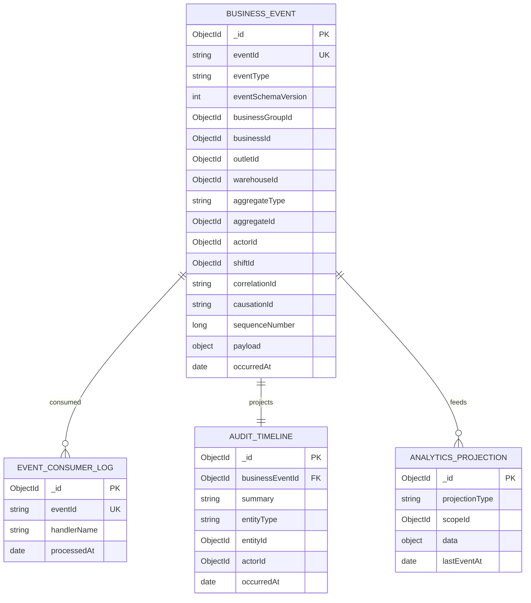

# Entity Relationship Diagram

**Project:** Warung Nafisah ERP  
**Document ID:** WN-ERD-001  
**Version:** 1.1.0  
**Status:** Draft — Awaiting Approval (Phase 0 Revision)

> Full Mongoose schemas with indexes will be detailed in Phase 1.  
> This document defines the conceptual data model reflecting enterprise hierarchy and event-driven architecture.

---

## 1. Design Principles

| Principle | Implementation |
|-----------|----------------|
| **Business Event DNA** | Every business action creates immutable `business_events` record |
| **Organizational hierarchy** | `businessGroupId` → `businessId` → `outletId` → `warehouseId` |
| **Event-driven side effects** | Inventory, cashflow, dashboard updated by event handlers — not inline |
| **No duplicate financial data** | Aggregates computed from ledger + event projections |
| **Immutability** | `business_events`, `recipe_versions`, `audit_timeline`, `purchase_price_history` — append-only |
| **FIFO batches** | `stock_batches` per warehouse |
| **Recipe versioning** | Active pointer on menu; historical versions immutable |
| **Unit conversion** | `unit_definitions` + `unit_conversions`; base unit per item |
| **Idempotent consumers** | `event_consumer_log` tracks processed `eventId` |

---

## 2. Organizational Hierarchy ERD



---

## 3. Core Business ERD



---

## 4. Event-Driven Architecture ERD



---

## 5. Collection Definitions

### 5.1 Organizational Hierarchy

#### `business_groups`
| Field | Type | Description |
|-------|------|-------------|
| _id | ObjectId | PK |
| name | String | Holding group name |
| isActive | Boolean | |
| createdAt | Date | |
| updatedAt | Date | |

**Indexes:** `{ isActive: 1 }`

---

#### `businesses`
| Field | Type | Description |
|-------|------|-------------|
| _id | ObjectId | PK |
| businessGroupId | ObjectId | FK → business_groups |
| name | String | Brand name |
| legalName | String | Legal entity |
| taxId | String | NPWP (optional) |
| isActive | Boolean | |
| createdAt | Date | |
| updatedAt | Date | |

**Indexes:** `{ businessGroupId: 1, isActive: 1 }`

---

#### `outlets`
| Field | Type | Description |
|-------|------|-------------|
| _id | ObjectId | PK |
| businessId | ObjectId | FK → businesses |
| businessGroupId | ObjectId | Denormalized for query |
| name | String | |
| address | String | |
| phone | String | |
| shiftConfig | Object | `{ morning: {start, end}, evening: {start, end} }` |
| settings | Object | Tax, receipt, approval thresholds |
| isActive | Boolean | |
| createdAt | Date | |
| updatedAt | Date | |

**Indexes:** `{ businessId: 1, isActive: 1 }`, `{ businessGroupId: 1 }`

---

#### `warehouses`
| Field | Type | Description |
|-------|------|-------------|
| _id | ObjectId | PK |
| outletId | ObjectId | FK → outlets |
| businessId | ObjectId | Denormalized |
| name | String | e.g. "Gudang Dapur" |
| type | String | kitchen, dry, cold, general |
| isDefault | Boolean | Default for outlet |
| isActive | Boolean | |
| createdAt | Date | |

**Indexes:** `{ outletId: 1, isActive: 1 }`, `{ outletId: 1, isDefault: 1 }`

---

### 5.2 Users & Access

#### `users`
| Field | Type | Description |
|-------|------|-------------|
| _id | ObjectId | PK |
| email | String | Unique |
| passwordHash | String | bcrypt |
| name | String | |
| role | String | owner, manager, cashier, kitchen, inventory, investor |
| businessGroupId | ObjectId | Scope |
| businessIds | [ObjectId] | Accessible businesses |
| outletIds | [ObjectId] | Accessible outlets |
| warehouseIds | [ObjectId] | Accessible warehouses |
| isActive | Boolean | |
| lastLoginAt | Date | |
| createdAt | Date | |
| updatedAt | Date | |

**Indexes:** `{ email: 1 }` unique, `{ outletIds: 1, role: 1 }`, `{ businessGroupId: 1 }`

---

### 5.3 Business Events (★ Core DNA)

#### `business_events`
| Field | Type | Description |
|-------|------|-------------|
| _id | ObjectId | PK |
| eventId | String | UUID — global idempotency key |
| eventType | String | SaleCompleted, PurchaseReceived, etc. |
| eventSchemaVersion | Number | Payload schema version |
| businessGroupId | ObjectId | |
| businessId | ObjectId | |
| outletId | ObjectId | |
| warehouseId | ObjectId | Optional |
| aggregateType | String | Order, PurchaseOrder, etc. |
| aggregateId | ObjectId | |
| actorId | ObjectId | FK → users |
| actorRole | String | |
| shiftId | ObjectId | Optional |
| deviceId | String | POS device (offline sync) |
| correlationId | String | Request chain |
| causationId | String | Parent eventId |
| sequenceNumber | Long | Per-outlet ordering |
| payload | Object | Full event data |
| occurredAt | Date | Business time |
| recordedAt | Date | Server time |

**Indexes:**
- `{ eventId: 1 }` unique
- `{ outletId: 1, sequenceNumber: -1 }`
- `{ outletId: 1, eventType: 1, occurredAt: -1 }`
- `{ aggregateType: 1, aggregateId: 1, occurredAt: -1 }`
- `{ businessGroupId: 1, occurredAt: -1 }`
- `{ correlationId: 1 }`

> **IMMUTABLE** — insert only. No update/delete API.

---

#### `event_consumer_log`
| Field | Type | Description |
|-------|------|-------------|
| _id | ObjectId | PK |
| eventId | String | FK → business_events.eventId |
| handlerName | String | InventoryEventHandler, etc. |
| processedAt | Date | |
| duration | Number | ms |

**Indexes:** `{ eventId: 1, handlerName: 1 }` unique

---

### 5.4 Units & Conversion

#### `unit_definitions`
| Field | Type | Description |
|-------|------|-------------|
| _id | ObjectId | PK |
| code | String | kg, gram, liter, ml, pcs, pack |
| name | String | Display name |
| category | String | weight, volume, count |
| isSystem | Boolean | Built-in vs custom |

**Indexes:** `{ code: 1 }` unique

---

#### `unit_conversions`
| Field | Type | Description |
|-------|------|-------------|
| _id | ObjectId | PK |
| businessId | ObjectId | Scope (null = global) |
| inventoryItemId | ObjectId | Optional — item-specific |
| fromUnit | String | |
| toUnit | String | |
| factor | Number | multiply by this |
| createdAt | Date | |

**Indexes:** `{ businessId: 1, inventoryItemId: 1, fromUnit: 1, toUnit: 1 }`

---

### 5.5 Menu & Recipe Versioning

#### `menu_items`
| Field | Type | Description |
|-------|------|-------------|
| _id | ObjectId | PK |
| businessGroupId | ObjectId | |
| businessId | ObjectId | |
| outletId | ObjectId | Outlet-specific or template |
| name | String | |
| category | String | |
| shift | String | morning, evening, all |
| price | Number | IDR |
| activeRecipeVersionId | ObjectId | FK → recipe_versions |
| isActive | Boolean | |
| sortOrder | Number | |
| createdAt | Date | |
| updatedAt | Date | |

**Indexes:** `{ outletId: 1, isActive: 1, shift: 1 }`

---

#### `recipe_versions` (IMMUTABLE)
| Field | Type | Description |
|-------|------|-------------|
| _id | ObjectId | PK |
| menuItemId | ObjectId | FK |
| version | Number | 1, 2, 3... |
| name | String | |
| ingredients | Array | `{ inventoryItemId, quantity, unit }` |
| calculatedHpp | Number | At version creation |
| ingredientCosts | Array | Snapshot of FIFO costs used |
| createdBy | ObjectId | |
| createdAt | Date | |
| changeReason | String | |

**Indexes:** `{ menuItemId: 1, version: -1 }` unique, `{ menuItemId: 1, createdAt: -1 }`

> Never updated. New version = new document.

---

### 5.6 Inventory

#### `inventory_items`
| Field | Type | Description |
|-------|------|-------------|
| _id | ObjectId | PK |
| businessGroupId | ObjectId | |
| businessId | ObjectId | |
| outletId | ObjectId | |
| warehouseId | ObjectId | FK → warehouses |
| sku | String | Unique per outlet |
| name | String | |
| type | String | raw_material, finished_good |
| baseUnit | String | FK → unit_definitions.code |
| category | String | |
| minStock | Number | |
| currentStock | Number | Denormalized (base unit) |
| trackExpiry | Boolean | |
| isActive | Boolean | |
| createdAt | Date | |
| updatedAt | Date | |

**Indexes:** `{ outletId: 1, warehouseId: 1, sku: 1 }` unique, `{ outletId: 1, currentStock: 1, minStock: 1 }`

---

#### `stock_batches` (FIFO)
| Field | Type | Description |
|-------|------|-------------|
| _id | ObjectId | PK |
| outletId | ObjectId | |
| warehouseId | ObjectId | |
| inventoryItemId | ObjectId | |
| quantity | Number | Remaining (base unit) |
| originalQuantity | Number | |
| unitCost | Number | Per base unit |
| receivedAt | Date | FIFO order |
| expiryDate | Date | |
| sourceType | String | purchase, production, adjustment, transfer |
| sourceId | ObjectId | |
| businessEventId | ObjectId | FK → business_events |

**Indexes:** `{ outletId: 1, warehouseId: 1, inventoryItemId: 1, receivedAt: 1 }`, `{ outletId: 1, expiryDate: 1 }`

---

#### `purchase_price_history` (IMMUTABLE)
| Field | Type | Description |
|-------|------|-------------|
| _id | ObjectId | PK |
| inventoryItemId | ObjectId | |
| supplierId | ObjectId | |
| outletId | ObjectId | |
| unitPrice | Number | |
| unit | String | As purchased |
| quantity | Number | |
| purchaseDate | Date | |
| purchaseOrderId | ObjectId | |
| businessEventId | ObjectId | |

**Indexes:** `{ inventoryItemId: 1, purchaseDate: -1 }`, `{ supplierId: 1, purchaseDate: -1 }`, `{ outletId: 1, purchaseDate: -1 }`

---

#### `stock_history`
| Field | Type | Description |
|-------|------|-------------|
| _id | ObjectId | PK |
| outletId | ObjectId | |
| warehouseId | ObjectId | |
| inventoryItemId | ObjectId | |
| type | String | in, out, adjustment, waste, expiry, transfer |
| quantity | Number | Base unit +/- |
| unitCost | Number | |
| totalCost | Number | |
| convertedFrom | Object | `{ unit, quantity }` if conversion applied |
| referenceType | String | |
| referenceId | ObjectId | |
| businessEventId | ObjectId | |
| performedBy | ObjectId | |
| createdAt | Date | |

**Indexes:** `{ outletId: 1, warehouseId: 1, inventoryItemId: 1, createdAt: -1 }`, `{ businessEventId: 1 }`

---

### 5.7 Orders, Payments, Receipts

#### `orders`
| Field | Type | Description |
|-------|------|-------------|
| _id | ObjectId | PK |
| businessGroupId | ObjectId | |
| businessId | ObjectId | |
| outletId | ObjectId | |
| orderNumber | String | |
| status | String | draft, pending, preparing, ready, completed, cancelled, refunded |
| shiftId | ObjectId | FK → shifts |
| lines | Array | See below |
| subtotal | Number | |
| discountAmount | Number | |
| approvalId | ObjectId | If discount needed approval |
| taxAmount | Number | |
| total | Number | |
| totalHpp | Number | |
| totalProfit | Number | |
| paymentMethod | String | |
| cashierId | ObjectId | |
| deviceId | String | Offline sync |
| completedAt | Date | |
| createdAt | Date | |
| updatedAt | Date | |

**Order line (embedded):**
```
{
  menuItemId, menuItemName, quantity, unitPrice,
  recipeVersionId, recipeSnapshot, hpp, profit,
  discountAmount, kitchenStation, itemStatus
}
```

**Indexes:** `{ outletId: 1, createdAt: -1 }`, `{ outletId: 1, orderNumber: 1 }` unique, `{ shiftId: 1 }`

---

#### `payments`
| Field | Type | Description |
|-------|------|-------------|
| _id | ObjectId | PK |
| outletId | ObjectId | |
| orderId | ObjectId | |
| method | String | cash, qris, transfer |
| amount | Number | |
| referenceNumber | String | |
| type | String | payment, refund |
| shiftId | ObjectId | |
| businessEventId | ObjectId | |
| processedBy | ObjectId | |
| createdAt | Date | |

**Indexes:** `{ outletId: 1, createdAt: -1 }`, `{ orderId: 1 }`, `{ shiftId: 1, method: 1 }`

---

#### `digital_receipts`
| Field | Type | Description |
|-------|------|-------------|
| _id | ObjectId | PK |
| orderId | ObjectId | |
| outletId | ObjectId | |
| publicToken | String | UUID for public URL |
| qrCodeUrl | String | |
| channels | Array | `{ type: print\|qr\|whatsapp\|email, status, sentAt, recipient }` |
| payload | Object | Receipt snapshot |
| createdAt | Date | |

**Indexes:** `{ publicToken: 1 }` unique, `{ orderId: 1 }`

---

### 5.8 Operations

#### `shifts`
| Field | Type | Description |
|-------|------|-------------|
| _id | ObjectId | PK |
| outletId | ObjectId | |
| type | String | cashier, kitchen |
| openedBy | ObjectId | |
| closedBy | ObjectId | |
| openedAt | Date | |
| closedAt | Date | |
| openingCash | Number | Cashier only |
| closingCash | Number | Actual count |
| expectedCash | Number | From events |
| cashVariance | Number | |
| status | String | open, closed |
| businessEventId | ObjectId | ShiftOpened/Closed |

**Indexes:** `{ outletId: 1, type: 1, status: 1 }`, `{ outletId: 1, openedAt: -1 }`

---

#### `daily_closings`
| Field | Type | Description |
|-------|------|-------------|
| _id | ObjectId | PK |
| outletId | ObjectId | |
| businessId | ObjectId | |
| closingDate | Date | Business date |
| shiftIds | [ObjectId] | Included shifts |
| totals | Object | `{ sales, hpp, profit, expenses }` |
| paymentReconciliation | Object | `{ cash, qris, transfer }` each: expected, actual, variance |
| status | String | draft, completed, locked |
| pdfUrl | String | Generated report |
| closedBy | ObjectId | |
| businessEventId | ObjectId | |
| createdAt | Date | |

**Indexes:** `{ outletId: 1, closingDate: -1 }` unique, `{ businessId: 1, closingDate: -1 }`

---

#### `approval_requests`
| Field | Type | Description |
|-------|------|-------------|
| _id | ObjectId | PK |
| outletId | ObjectId | |
| type | String | discount, void, refund, purchase, payroll, stock_adjustment |
| status | String | pending, approved, rejected, expired |
| requestedBy | ObjectId | |
| approvedBy | ObjectId | |
| payload | Object | Action details |
| referenceType | String | Order, PurchaseOrder, etc. |
| referenceId | ObjectId | |
| reason | String | |
| expiresAt | Date | |
| businessEventId | ObjectId | |
| createdAt | Date | |
| resolvedAt | Date | |

**Indexes:** `{ outletId: 1, status: 1, createdAt: -1 }`, `{ requestedBy: 1 }`, `{ type: 1, status: 1 }`

---

### 5.9 Financial

#### `cashflow_entries`
| Field | Type | Description |
|-------|------|-------------|
| _id | ObjectId | PK |
| businessGroupId | ObjectId | |
| businessId | ObjectId | |
| outletId | ObjectId | |
| type | String | in, out |
| category | String | sale, purchase, expense, salary, refund |
| amount | Number | |
| paymentMethod | String | |
| referenceType | String | |
| referenceId | ObjectId | |
| businessEventId | ObjectId | Source event |
| date | Date | |
| createdAt | Date | |

**Indexes:** `{ outletId: 1, date: -1 }`, `{ businessEventId: 1 }`, `{ outletId: 1, paymentMethod: 1, date: -1 }`

---

### 5.10 Notifications

#### `notification_rules`
| Field | Type | Description |
|-------|------|-------------|
| _id | ObjectId | PK |
| businessId | ObjectId | |
| outletId | ObjectId | Optional — null = all outlets |
| eventType | String | LowStockDetected, etc. |
| channels | Array | in_app, push, whatsapp, email |
| recipients | Array | roles or userIds |
| thresholds | Object | Configurable |
| isActive | Boolean | |

---

#### `notification_deliveries`
| Field | Type | Description |
|-------|------|-------------|
| _id | ObjectId | PK |
| userId | ObjectId | |
| outletId | ObjectId | |
| type | String | |
| title | String | |
| message | String | |
| channel | String | |
| status | String | pending, sent, read, failed |
| businessEventId | ObjectId | |
| createdAt | Date | |
| readAt | Date | |

**Indexes:** `{ userId: 1, status: 1, createdAt: -1 }`

---

### 5.11 Audit & Analytics

#### `audit_timeline` (IMMUTABLE)
| Field | Type | Description |
|-------|------|-------------|
| _id | ObjectId | PK |
| businessGroupId | ObjectId | |
| businessId | ObjectId | |
| outletId | ObjectId | |
| businessEventId | ObjectId | |
| eventType | String | |
| summary | String | Human-readable |
| entityType | String | |
| entityId | ObjectId | |
| actorId | ObjectId | |
| actorName | String | Denormalized |
| metadata | Object | |
| occurredAt | Date | |

**Indexes:** `{ outletId: 1, occurredAt: -1 }`, `{ actorId: 1, occurredAt: -1 }`, `{ entityType: 1, entityId: 1 }`

---

#### `audit_logs` (Security — HTTP level)
| Field | Type | Description |
|-------|------|-------------|
| _id | ObjectId | PK |
| userId | ObjectId | |
| action | String | login, permission_denied, etc. |
| ipAddress | String | |
| userAgent | String | |
| createdAt | Date | |

---

#### `analytics_projections`
| Field | Type | Description |
|-------|------|-------------|
| _id | ObjectId | PK |
| projectionType | String | hourly_sales, item_demand, etc. |
| scopeType | String | outlet, business, group |
| scopeId | ObjectId | |
| period | String | 2026-07-01, 2026-W27, 2026-07 |
| data | Object | Pre-computed features |
| lastEventId | String | |
| updatedAt | Date | |

**Indexes:** `{ projectionType: 1, scopeId: 1, period: 1 }` unique

---

### 5.12 Offline Sync

#### `sync_devices`
| Field | Type | Description |
|-------|------|-------------|
| _id | ObjectId | PK |
| deviceId | String | Unique device fingerprint |
| outletId | ObjectId | |
| lastSyncAt | Date | |
| lastSequenceNumber | Long | |
| status | String | online, offline, syncing |
| createdAt | Date | |

**Indexes:** `{ deviceId: 1 }` unique, `{ outletId: 1 }`

---

#### `sync_conflicts`
| Field | Type | Description |
|-------|------|-------------|
| _id | ObjectId | PK |
| deviceId | String | |
| outletId | ObjectId | |
| localEvent | Object | |
| serverState | Object | |
| resolution | String | pending, server_wins, manual |
| resolvedBy | ObjectId | |
| createdAt | Date | |

---

### 5.13 System Operations

#### `backup_jobs`
| Field | Type | Description |
|-------|------|-------------|
| _id | ObjectId | PK |
| type | String | local, cloud |
| status | String | running, completed, failed |
| location | String | Path or URL |
| sizeBytes | Number | |
| startedAt | Date | |
| completedAt | Date | |
| error | String | |

**Indexes:** `{ type: 1, completedAt: -1 }`

---

#### `system_health_metrics`
| Field | Type | Description |
|-------|------|-------------|
| _id | ObjectId | PK |
| metric | String | api_latency, queue_depth, disk_usage |
| value | Number | |
| unit | String | ms, count, percent |
| severity | String | ok, warning, critical |
| recordedAt | Date | |

**Indexes:** `{ metric: 1, recordedAt: -1 }`, TTL index on `recordedAt` (30 days)

---

### 5.14 Purchasing, HR, Assets

*(Retained from v1.0 with added scoping fields `businessGroupId`, `businessId`, `warehouseId`, `businessEventId`)*

- `suppliers` — business-scoped
- `purchase_orders` — outlet + warehouse + approvalId
- `production_batches` — outlet + warehouse + recipeVersionId
- `expense_categories`, `expenses` — outlet-scoped
- `employees`, `attendances`, `salary_records` — outlet-scoped
- `assets` — outlet-scoped (includes gas cylinder tracking for alerts)

---

## 6. Collection Summary (v1.1)

| # | Collection | Type | Immutable |
|---|------------|------|-----------|
| 1 | business_groups | Master | |
| 2 | businesses | Master | |
| 3 | outlets | Master | |
| 4 | warehouses | Master | |
| 5 | users | Master | |
| 6 | **business_events** | **Event Store** | **★ Yes** |
| 7 | event_consumer_log | System | Yes |
| 8 | unit_definitions | Master | |
| 9 | unit_conversions | Config | |
| 10 | menu_items | Master | |
| 11 | **recipe_versions** | Version | **★ Yes** |
| 12 | inventory_items | Master | |
| 13 | stock_batches | Transactional | |
| 14 | stock_history | Log | Yes |
| 15 | **purchase_price_history** | Analytical | **★ Yes** |
| 16 | orders | Transactional | |
| 17 | payments | Transactional | |
| 18 | digital_receipts | Transactional | |
| 19 | shifts | Operational | |
| 20 | daily_closings | Operational | |
| 21 | approval_requests | Workflow | |
| 22 | cashflow_entries | Ledger | Yes |
| 23 | notification_rules | Config | |
| 24 | notification_deliveries | Log | |
| 25 | **audit_timeline** | Activity | **★ Yes** |
| 26 | audit_logs | Security | Yes |
| 27 | analytics_projections | Read Model | |
| 28 | sync_devices | Sync | |
| 29 | sync_conflicts | Sync | |
| 30 | backup_jobs | System | Yes |
| 31 | system_health_metrics | Metrics | TTL |
| 32+ | suppliers, purchase_orders, production_batches, expenses, employees, attendances, salary_records, assets | | |

**Total: 38 collections** (up from 20 in v1.0)

---

## 7. Multi-Tenant Query Pattern

```javascript
// MANDATORY scoping — every query
const scope = {
  businessGroupId: ctx.businessGroupId,
  businessId: ctx.businessId,        // optional widen for owner
  outletId: ctx.outletId,            // optional widen for manager+
  warehouseId: ctx.warehouseId       // inventory ops only
};

// Event stream query (AI / analytics)
db.business_events.find({
  businessGroupId: ctx.businessGroupId,
  occurredAt: { $gte: start, $lte: end }
}).sort({ sequenceNumber: 1 });
```

---

## 8. Approval

| Item | Status |
|------|--------|
| Hierarchy model (4 levels) | ☐ |
| business_events as DNA | ☐ |
| 38 collections approved | ☐ |
| Index strategy approved | ☐ |
| Immutable collections identified | ☐ |
