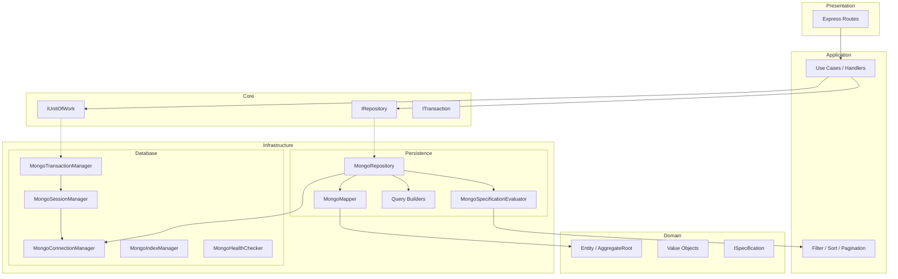
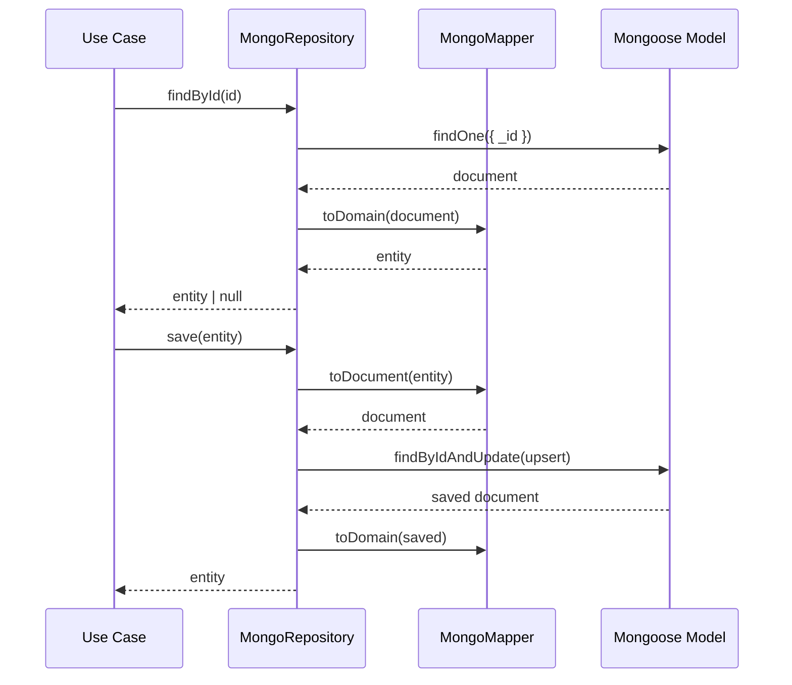
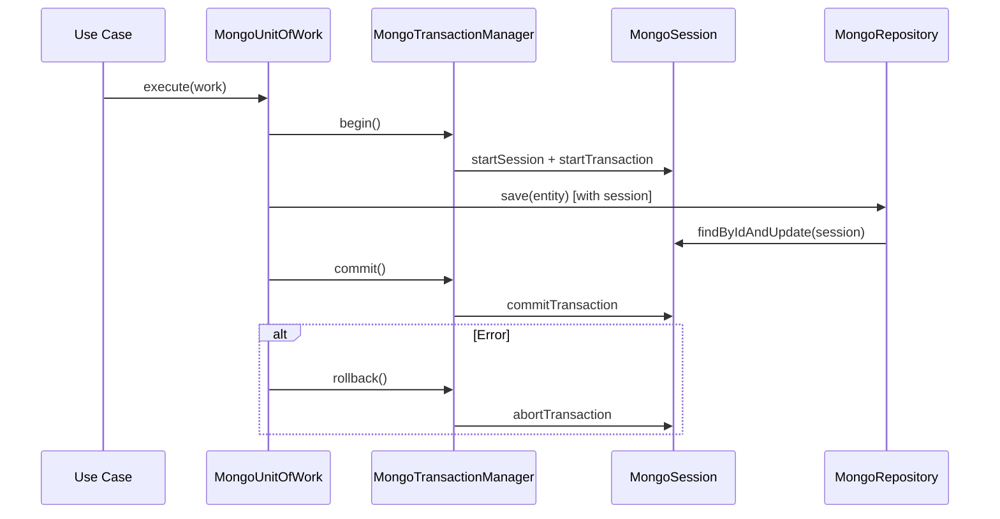
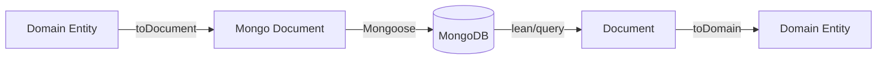
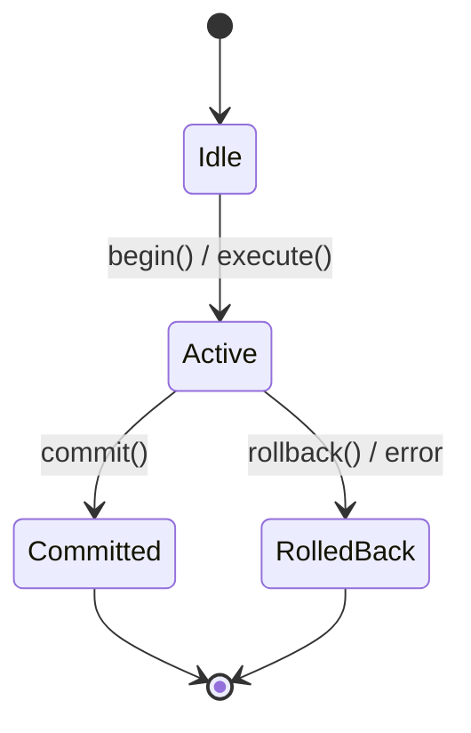
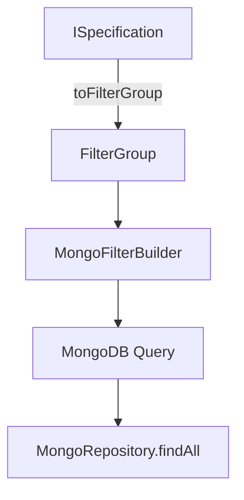
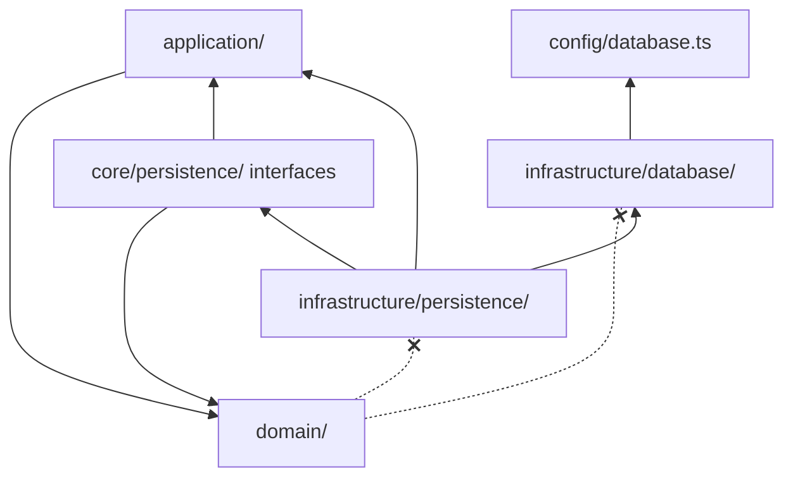

# Persistence Framework — Database Architecture

**Document ID:** WN-DB-PERSIST-001  
**Version:** 0.8.0  
**Date:** 2026-07-11  
**Sprint:** 3B

---

## 1. Architecture Diagram



---

## 2. Repository Flow



---

## 3. Transaction Flow



---

## 4. Mapper Flow



**Rules:**
- Mapper is injected per aggregate — no global mapping
- Domain types never import mongoose
- Documents live in infrastructure layer only

---

## 5. Unit Of Work Flow



`MongoUnitOfWork.execute()` wraps work in begin → commit/rollback with session propagation to repositories.

---

## 6. Specification Flow



`FilterSpecification` bridges Sprint 2 `FilterObject` to `ISpecification` for MongoDB queries.

---

## 7. Dependency Graph



**Domain has NO dependency on MongoDB** (enforced).

---

## 8. Index Manager

| Type | Support |
|------|---------|
| Unique | `type: 'unique'` |
| Compound | multiple keys in `keys` |
| Text | text index keys |
| TTL | `expireAfterSeconds` |
| Partial | `partialFilterExpression` |

---

## 9. Base Document Hierarchy

```
BaseDocument (_id)
└── TimestampDocument (createdAt, updatedAt)
    ├── AuditDocument (+ createdBy, updatedBy)
    ├── SoftDeleteDocument (+ deletedAt, isDeleted)
    └── VersionedDocument (+ version)
```

---

## 10. Usage Pattern (Future Modules)

```typescript
class OrderRepository extends MongoRepository<Order, OrderDocument> {
  constructor(model: Model<OrderDocument>, mapper: OrderMapper, uow: MongoUnitOfWork) {
    super(model, mapper, { softDelete: true }, () => uow.getActiveSession());
  }
}
```

No business repositories created in Sprint 3B — pattern only.
