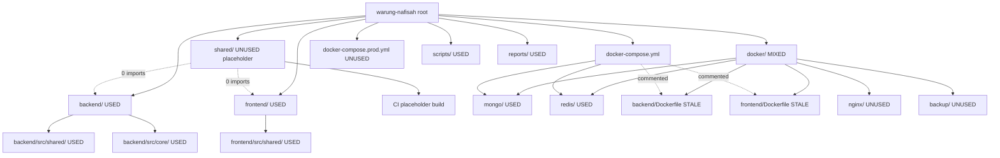
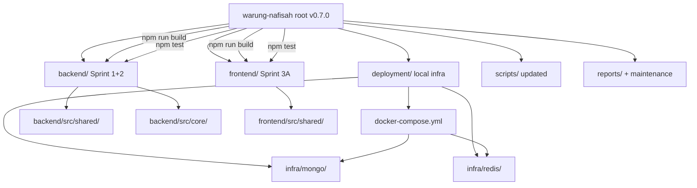

# Project Structure Cleanup Report

**Document ID:** WN-MAINT-CLEANUP-001  
**Date:** 2026-07-11  
**Version:** 0.7.0  
**Status:** Complete

---

## 1. Executive Summary

Maintenance cleanup aligned the repository with **ADR-001** and post-Sprint implementation reality. Removed unused monorepo placeholders (`shared/` workspace), stale Docker artifacts, and obsolete Phase 1.1 stubs. Relocated active local infrastructure to `deployment/`. **No Sprint 1, 2, or 3A application code was removed.**

---

## 2. Audit Methodology

| Step | Action |
|------|--------|
| 1 | Full directory inventory + grep for imports/references |
| 2 | Classification: USED / UNUSED / UNKNOWN per item |
| 3 | Impact analysis: dependents, build risk, runtime risk |
| 4 | Safe cleanup: delete/move only confirmed-unused items |
| 5 | Self-verification: `npm install`, `npm run build`, `npm test` |

---

## 3. Folders Examined

| Folder | Verdict | Action |
|--------|---------|--------|
| `backend/` | **USED** | Kept — Sprint 1+2 implementation |
| `frontend/` | **USED** | Kept — Sprint 3A implementation |
| `shared/` (root workspace) | **UNUSED** | **Deleted** — zero imports, ADR-001 abandoned |
| `backend/src/shared/` | **USED** | Kept — backend DTO/HTTP helpers (not npm package) |
| `frontend/src/shared/` | **USED** | Kept — UI lib (`@/shared/...`) |
| `backend/src/core/` | **USED** | Kept — Sprint 2 persistence contracts |
| `core/` (top-level) | **N/A** | Already removed (migrated to backend) |
| `docker/` | **MIXED → stale** | **Deleted** — only .gitkeep + broken Dockerfiles |
| `deployment/` | **NEW** | **Created** — active infra configs |
| `scripts/` | **USED** | Kept — updated build/dev scripts |
| `reports/` | **USED** | Kept — living documentation |
| `node_modules/` | **Artifact** | Kept (regenerated by npm) |
| `.github/`, `.husky/`, `.vscode/` | **USED** | Kept — CI + dev tooling |

---

## 4. Files Examined & Decisions

### 4.1 Deleted (confirmed UNUSED)

| Item | Reason |
|------|--------|
| `shared/` entire workspace | Placeholder only; no `@warung-nafisah/shared` imports in backend/frontend |
| `shared/package.json`, `shared/README.md` | Echo stub scripts only |
| `shared/*/.gitkeep` scaffold dirs | Empty placeholders |
| `docker/backend/Dockerfile` | Broken: referenced removed `core/` workspace, port 4000, wrong entry |
| `docker/frontend/Dockerfile` | ADR-001: frontend deploys to Vercel, not Docker |
| `docker/nginx/nginx.conf` | Only referenced in commented compose block |
| `docker/backup/Dockerfile`, `backup.sh` | Not referenced by any compose or CI |
| `docker/scripts/wait-for-mongo.sh` | Not referenced |
| `docker/*/`.gitkeep` empty dirs | Scaffold only after config files removed |
| `docker-compose.yml` (root) | Replaced by `deployment/docker-compose.yml` |
| `docker-compose.prod.yml` | Unused skeleton; zero CI/Makefile references |
| `backend/scripts/scaffold-folders.mjs` | Duplicate of root `scripts/scaffold-folders.mjs` |

### 4.2 Moved

| From | To | Reason |
|------|-----|--------|
| `docker/mongo/init-replica.js` | `deployment/infra/mongo/init-replica.js` | Active — used by compose |
| `docker/redis/redis.conf` | `deployment/infra/redis/redis.conf` | Active — used by compose |
| `docker-compose.yml` (logic) | `deployment/docker-compose.yml` | ADR-001 deployment folder pattern |

### 4.3 Kept (USED or UNKNOWN)

| Item | Reason |
|------|--------|
| `backend/src/**` (all sprint code) | Sprint 1+2 — explicit rule |
| `frontend/src/**` (all sprint code) | Sprint 3A — explicit rule |
| `scripts/scaffold-folders.mjs` | Referenced by `npm run scaffold` |
| `scripts/verify-structure.mjs` | Referenced by `npm run verify:structure` |
| `scripts/expected-folders.json` | Manifest for scaffold/verify — **updated** |
| Root ESLint, Prettier, Husky, Commitlint | Active dev tooling |
| `Makefile` | **Updated** — points to `deployment/` |
| Historical `reports/**` docs | **UNKNOWN for deletion** — archival value; references to old paths remain as history |

### 4.4 Updated (not deleted)

| File | Change |
|------|--------|
| `package.json` | Removed `shared` workspace; added `test` script; version 0.7.0 |
| `scripts/build.mjs` | Delegates to backend + frontend real builds |
| `scripts/dev.mjs` | Shows workspace dev commands + deployment compose |
| `scripts/expected-folders.json` | Removed `shared/`, `docker/`; added `deployment/`, sprint paths |
| `.github/workflows/ci.yml` | Real build/test; deployment compose validation |
| `Makefile` | `infra-up/down` → `deployment/docker-compose.yml` |
| `README.md` | Reflects current sprint status |
| `.env.example` | Port 5000/3000; removed obsolete REDIS_HOST split vars |
| `package-lock.json` | Regenerated — removed `@warung-nafisah/shared` |

---

## 5. Impact Analysis (Deleted Items)

| Deleted Item | Dependents | Build Risk | Runtime Risk |
|--------------|------------|------------|--------------|
| `shared/` workspace | CI placeholder build only | None after CI update | None |
| `docker/backend/Dockerfile` | Commented compose only | None | None |
| `docker/frontend/Dockerfile` | Commented compose only | None | None |
| `docker-compose.prod.yml` | Docs only | None | None |
| `backend/scripts/scaffold-folders.mjs` | None | None | None |

**Conclusion:** All deletions are safe. No Sprint implementation code affected.

---

## 6. `shared/` Decision (Special Review)

| Path | Package? | Imports | Decision |
|------|----------|---------|----------|
| `shared/` (root) | `@warung-nafisah/shared` | 0 | **Deleted** |
| `backend/src/shared/` | In-repo module | Used by backend | **Kept** |
| `frontend/src/shared/` | In-repo module (`@/shared`) | Used by frontend | **Kept** |

Per ADR-001, shared contracts move to OpenAPI — not an npm package. No migration to `backend/shared/` needed because `backend/src/shared/` already exists and is the correct location.

---

## 7. `docker/` Decision (Special Review)

| Artifact | Status | Action |
|----------|--------|--------|
| MongoDB init + Redis config | Used for local dev | Moved to `deployment/infra/` |
| Backend/Frontend Dockerfiles | Stale, broken | Deleted |
| Nginx, backup, scripts | Unused skeleton | Deleted |
| Root compose files | Superseded | Deleted / relocated |

Production VPS stack deferred to backend repository per ADR-001 roadmap.

---

## 8. Dependency Graph — Before

---

## 9. Dependency Graph — After

---

## 10. Configuration Review

| Config | Status | Notes |
|--------|--------|-------|
| `package.json` | ✅ Updated | 2 workspaces: backend, frontend |
| `backend/tsconfig.json` | ✅ Kept | Used by `tsc` |
| `frontend/tsconfig.json` | ✅ Kept | Used by Next.js |
| Root `tsconfig.json` | N/A | Never existed — correct |
| `eslint.config.js` (root) | ✅ Kept | Lints `scripts/` |
| `backend/eslint.config.js` | ✅ Kept | Backend lint |
| `frontend` via `next lint` | ✅ Kept | |
| `.prettierrc` | ✅ Kept | |
| `.husky/` | ✅ Kept | |
| `commitlint.config.js` | ✅ Kept | |
| `lint-staged.config.js` | ✅ Kept | |

---

## 11. Self-Verification Results

| Check | Result |
|-------|--------|
| `npm install` | ✅ PASS |
| `npm run verify:structure` | ✅ PASS (after `reports/maintenance/` created) |
| `npm run build` | ✅ PASS (backend tsc + frontend next build) |
| `npm test` | ✅ PASS (56 backend + 2 frontend = 58 total) |
| `docker compose -f deployment/docker-compose.yml config` | ✅ PASS |
| Sprint 1 code intact | ✅ Verified |
| Sprint 2 code intact | ✅ Verified |
| Sprint 3A code intact | ✅ Verified |

---

## 12. Items Retained Despite Staleness (UNKNOWN)

| Item | Why kept |
|------|----------|
| Future scaffold folders in `expected-folders.json` | Roadmap skeleton — `npm run scaffold` recreates for upcoming sprints |
| Historical reports referencing `docker/`, `shared/` | Documentation archive — not runtime dependencies |
| `docker/` references in old report files | Updated only in this maintenance report; historical docs unchanged |

---

## 13. Recommended Follow-ups (Not in Scope)

- Split into three Git repositories per ADR-001
- Add `openapi/` contract directory
- Production `docker-compose` in backend repo when deployment sprint starts
- Update historical report files to note deprecated paths (optional)

---

**STOP — Maintenance cleanup complete. No further sprint work performed.**
