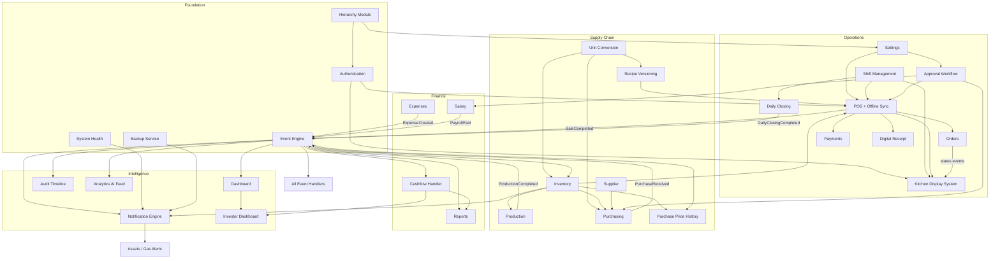

# Module Overview

**Project:** Warung Nafisah ERP  
**Document ID:** WN-MOD-000  
**Version:** 1.1.0  
**Status:** Draft — Phase 0 Revision

> Per-module detailed specifications will be created during each implementation phase.

---

## 1. Architectural DNA

> **"Every business action creates a permanent business event."**

All modules publish to or consume from the `business_events` stream. See [Event-Driven Architecture](../architecture/09-event-driven-architecture.md).

---

## 2. Module Map (v1.1)

| # | Module | Priority | Phase | Description |
|---|--------|----------|-------|-------------|
| 0 | **Hierarchy** | P0 | 3 | Business Group → Business → Outlet → Warehouse |
| 1 | **Event Engine** | P0 | 2-3 | Event store, bus, handlers, consumer log |
| 2 | Authentication | P0 | 3 | JWT, RBAC, multi-level scope |
| 3 | Settings | P0 | 4 | Outlet config, units, approval thresholds |
| 4 | Shift Management | P0 | 4 | Cashier + kitchen shifts, open/close |
| 5 | Dashboard | P0 | 4 | Event-projected real-time KPIs |
| 6 | POS | P0 | 4 | Tablet checkout, offline event queue |
| 7 | **KDS** | P0 | 4 | Kitchen Display System (WebSocket) |
| 8 | Orders | P0 | 4 | Order lifecycle, station routing |
| 9 | Payments | P0 | 4 | Cash, QRIS, Transfer |
| 10 | **Digital Receipt** | P1 | 4 | Print, QR, WhatsApp, Email |
| 11 | Inventory | P0 | 4-5 | Multi-warehouse, FIFO, unit conversion |
| 12 | Recipes | P0 | 4 | Immutable versioned recipes, HPP |
| 13 | Production | P1 | 5 | Raw → finished, event-driven |
| 14 | Purchasing | P1 | 6 | PO with approval, price history |
| 15 | Supplier | P1 | 6 | Supplier master |
| 16 | Expenses | P1 | 7 | Non-COGS expenses |
| 17 | **Approval Workflow** | P0 | 4 | Discount, void, refund, purchase, payroll |
| 18 | **Daily Closing** | P0 | 4 | Reconciliation, PDF, day lock |
| 19 | Reports | P0 | 4+ | Event-sourced aggregations |
| 20 | **Notification Engine** | P1 | 4-5 | Rules, multi-channel delivery |
| 21 | **Audit Timeline** | P0 | 3 | Human-readable activity stream |
| 22 | **Offline Sync** | P1 | 5 | POS event upload, conflict resolution |
| 23 | Employees | P2 | 8 | Staff master |
| 24 | Attendance | P2 | 8 | Clock in/out |
| 25 | Salary | P2 | 8 | Payroll with approval |
| 26 | Assets | P2 | 5 | Fixed assets + gas monitoring |
| 27 | Investor Dashboard | P3 | 9 | Read-only, event-projected |
| 28 | **Analytics / AI Feed** | P2 | 5 | Event export, projections |
| 29 | **System Health** | P1 | 2 | Monitoring dashboard |
| 30 | **Backup** | P1 | 2 | Local + cloud automated backup |

---

## 3. Cross-Cutting Services

| Service | Description | Layer |
|---------|-------------|-------|
| **Event Store** | Append-only `business_events` | Infrastructure |
| **Event Bus** | In-process + BullMQ async dispatch | Infrastructure |
| **Event Handlers** | Inventory, Cashflow, Dashboard, etc. | Infrastructure |
| **Unit Conversion Engine** | Dynamic unit transform | Domain |
| **FIFO Engine** | Per-warehouse batch consumption | Domain |
| **HPP Calculator** | Recipe version + FIFO costs | Domain |
| **Approval Service** | Request → approve → execute pattern | Application |
| **PDF Generator** | Daily closing, reports | Infrastructure |
| **Receipt Service** | Print, QR, WhatsApp, Email | Infrastructure |
| **Sync Agent** | Offline event merge | Infrastructure |
| **Backup Service** | mongodump + cloud upload | Infrastructure |
| **Health Collector** | Metrics → system_health_metrics | Infrastructure |

---

## 4. Module Dependency Diagram (v1.1)



---

## 5. Event Publisher / Consumer Matrix

| Module | Publishes | Consumes |
|--------|-----------|----------|
| POS | SaleCreated, SaleCompleted, SaleVoided, SaleRefunded, DiscountApplied | ApprovalGranted |
| KDS | OrderItemReady | SaleCompleted, SaleCreated |
| Purchasing | PurchaseCreated, PurchaseReceived, PurchasePriceRecorded | ApprovalGranted |
| Production | ProductionCompleted | — |
| Inventory | InventoryAdjusted, InventoryWasted, InventoryExpired | InventoryConsumed, InventoryReceived |
| Expenses | ExpenseCreated | — |
| Salary | PayrollApproved, PayrollPaid | ApprovalGranted |
| Shifts | ShiftOpened, ShiftClosed | — |
| Daily Closing | DailyClosingCompleted | ShiftClosed |
| Approvals | ApprovalRequested, ApprovalGranted, ApprovalRejected | — |
| Recipes | RecipeVersionCreated, RecipeVersionActivated | PurchasePriceRecorded |
| Sync | SyncBatchUploaded, SyncConflictDetected | — |
| System | BackupCompleted, SystemHealthAlert | — |
| **Handlers (not modules)** | — | All above → side effects |

---

## 6. Zero Duplicate Input via Events

| User Action | Single Command | Events Published | Handler Effects |
|-------------|----------------|------------------|-----------------|
| Complete sale | `CompleteSale` | `SaleCompleted` | Inventory↓, Cashflow↑, HPP, Dashboard, KDS, Receipt, Audit |
| Receive purchase | `ReceivePurchase` | `PurchaseReceived`, `PurchasePriceRecorded` | Inventory↑, Cashflow↓, Price history, Audit |
| Run production | `CompleteProduction` | `ProductionCompleted` | Raw↓, Finished↑, Audit |
| Record expense | `CreateExpense` | `ExpenseCreated` | Cashflow↓, Dashboard, Audit |
| Close day | `CompleteDailyClosing` | `DailyClosingCompleted` | PDF, Day lock, Dashboard, Audit |

---

## 7. Role → Module Access Matrix (Updated)

| Module | Owner | Manager | Cashier | Kitchen | Inventory | Investor |
|--------|-------|---------|---------|---------|-----------|----------|
| Hierarchy | ✅ | 👁️ | ❌ | ❌ | ❌ | ❌ |
| Dashboard | ✅ | ✅ | ❌ | ❌ | ❌ | ❌ |
| POS | ✅ | ✅ | ✅ | ❌ | ❌ | ❌ |
| KDS | ✅ | ✅ | ❌ | ✅ | ❌ | ❌ |
| Shift Management | ✅ | ✅ | ✅¹ | ✅¹ | ❌ | ❌ |
| Approvals | ✅ | ✅ | ❌ | ❌ | ❌ | ❌ |
| Daily Closing | ✅ | ✅ | ❌ | ❌ | ❌ | ❌ |
| Inventory | ✅ | ✅ | ❌ | ❌ | ✅ | ❌ |
| Purchasing | ✅ | ✅ | ❌ | ❌ | ✅ | ❌ |
| Audit Timeline | ✅ | ✅ | ❌ | ❌ | ❌ | ❌ |
| System Health | ✅ | ❌ | ❌ | ❌ | ❌ | ❌ |
| Investor Dashboard | ✅ | ❌ | ❌ | ❌ | ❌ | ✅ |
| Analytics / AI | ✅ | 👁️ | ❌ | ❌ | ❌ | ❌ |

¹ Own shift only (open/close)

---

## 8. Implementation Order (v1.1)

```
Phase 2:  Event Engine scaffold, Health, Backup infrastructure
Phase 3:  Hierarchy, Auth, Audit Timeline, Event handlers (skeleton)
Phase 4:  Settings, Shifts, Approvals, Units, Recipes, Inventory,
          POS, KDS, Orders, Payments, Digital Receipt, Daily Closing,
          Dashboard, Reports, Notification Engine (core)
Phase 5:  Production, Offline Sync, Inventory advanced, Analytics feed
Phase 6:  Purchasing, Supplier, Price History
Phase 7:  Expenses, Financial reports, Refund
Phase 8:  HR (Employees, Attendance, Salary)
Phase 9:  Investor Dashboard, Assets, Advanced notifications
Phase 10: Production hardening, load test, security audit
```
