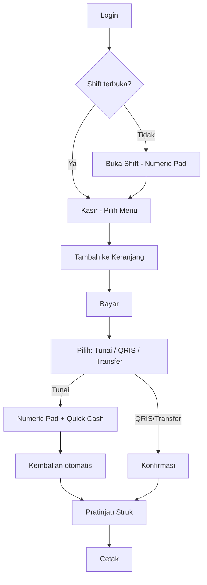

# Mobile POS UX Guideline

**Document ID:** WN-UI-MOBILE-POS-001  
**Version:** 0.10.1  
**Sprint:** 4.5.1

---

## 1. UX Principles

| # | Principle | Implementation |
|---|-----------|------------------|
| 1 | Mobile First | Layout optimized 360–430px; desktop is secondary |
| 2 | One Hand Operation | Primary actions bottom: nav, cart, bayar |
| 3 | Zero Keyboard | Chips, numeric pad, card buttons — no text input in POS flow |
| 4 | Three Click Rule | Menu → Bayar → Uang pas → Cetak |
| 5 | Touch Friendly | Minimum 48px touch targets |
| 6 | Bahasa Indonesia | All labels in Indonesian |

---

## 2. Wireframe (Mobile Kasir)

```
┌─────────────────────────────┐
│ Warung Nafisah        Kasir │
├─────────────────────────────┤
│ 🔍 Cari menu...             │
│ [Semua][Pecel][Model]...    │
│ ⭐ Favorit: [Pecel][Es Teh] │
│ ┌─────────┐ ┌─────────┐     │
│ │  🐟     │ │  🍗     │  +  │
│ │Pecel    │ │Model    │     │
│ │18.000   │ │15.000   │     │
│ └─────────┘ └─────────┘     │
│                             │
│ ┌─────────────────────────┐ │
│ │ 🛒 3 item    Rp41.000   │ │
│ │              [  BAYAR ] │ │
│ └─────────────────────────┘ │
├─────────────────────────────┤
│ Kasir │Riwayat│Shift│Profil│
└─────────────────────────────┘
```

---

## 3. Mobile Flow



---

## 4. Touch Flow (Thumb Zone)

```
┌─────────────────────────────┐
│         INFO ZONE           │  ← Search, kategori (scroll horizontal)
│         MENU GRID           │  ← Tap + atau card
│                             │
│    ═══ THUMB ZONE ═══       │
│    Floating Cart + Bayar    │  ← Primary action
│    Bottom Navigation        │  ← Kasir / Riwayat / Shift / Profil
└─────────────────────────────┘
```

---

## 5. Navigation Flow

| Tab | Route | Fungsi |
|-----|-------|--------|
| Kasir | `/pos` | Transaksi utama |
| Riwayat | `/pos/history` | Transaksi hari ini |
| Shift | `/shift` | Buka/tutup shift |
| Profil | `/profil` | Akun, favorit, keluar |

Desktop (md+): Sidebar dengan Kasir, Riwayat, Shift, Ringkasan (owner).

---

## 6. Payment UX

| Metode | UI |
|--------|-----|
| Tunai | 💵 Card + numeric pad + quick cash + kembalian besar |
| QRIS | 📱 Card + konfirmasi |
| Transfer | 🏦 Card + konfirmasi |

Quick cash menyesuaikan total (pas, bulat ribuan, 50rb, 100rb).

---

## 7. Future PWA Roadmap

| Phase | Feature |
|-------|---------|
| **4.5.1 (now)** | `manifest.json`, viewport, standalone metadata |
| Next | App icons (192/512), splash screen |
| Next | Service worker shell cache |
| Next | Offline menu cache (read-only) |
| Next | Offline queue for sales sync |
| Future | Push notification (shift reminder) |
| Future | Install prompt on Android home screen |

---

## 8. Self-Review

| Persona | Assessment |
|---------|------------|
| Owner | Ringkasan omset di `/owner` atau profil; bisa atur menu favorit |
| Kasir baru | Alur linear: shift → tap menu → bayar; tanpa istilah teknis |
| Karyawan awam | Bottom nav jelas; tombol besar; bahasa Indonesia; tanpa keyboard |

---

## Related

- [Sprint 4.5.1 Implementation](../sprint4.5.1/implementation-report.md)
- [Operational POS MVP](../business/operational-pos-mvp.md)
